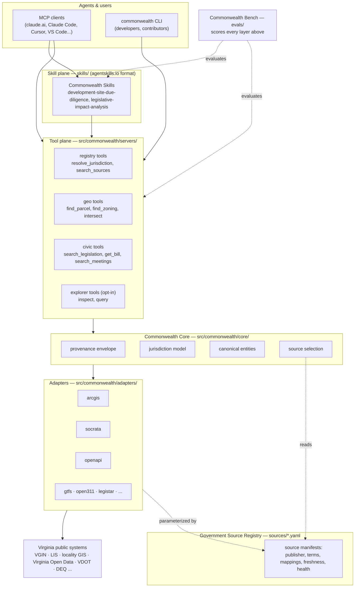
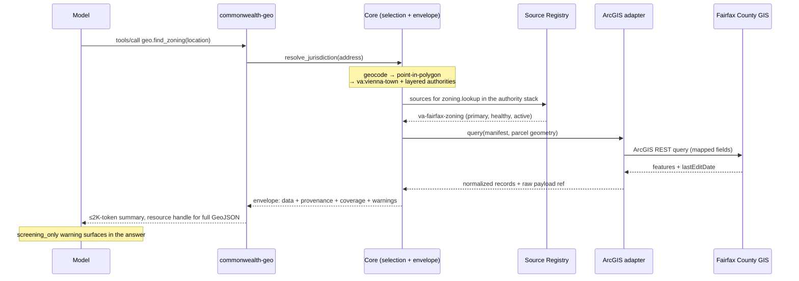
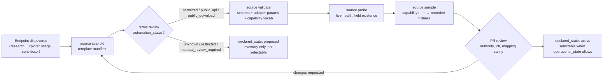
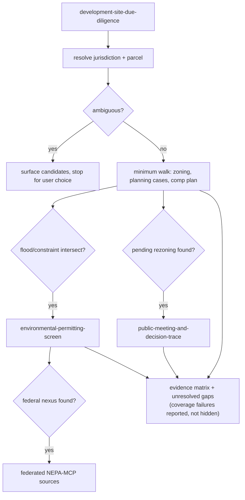
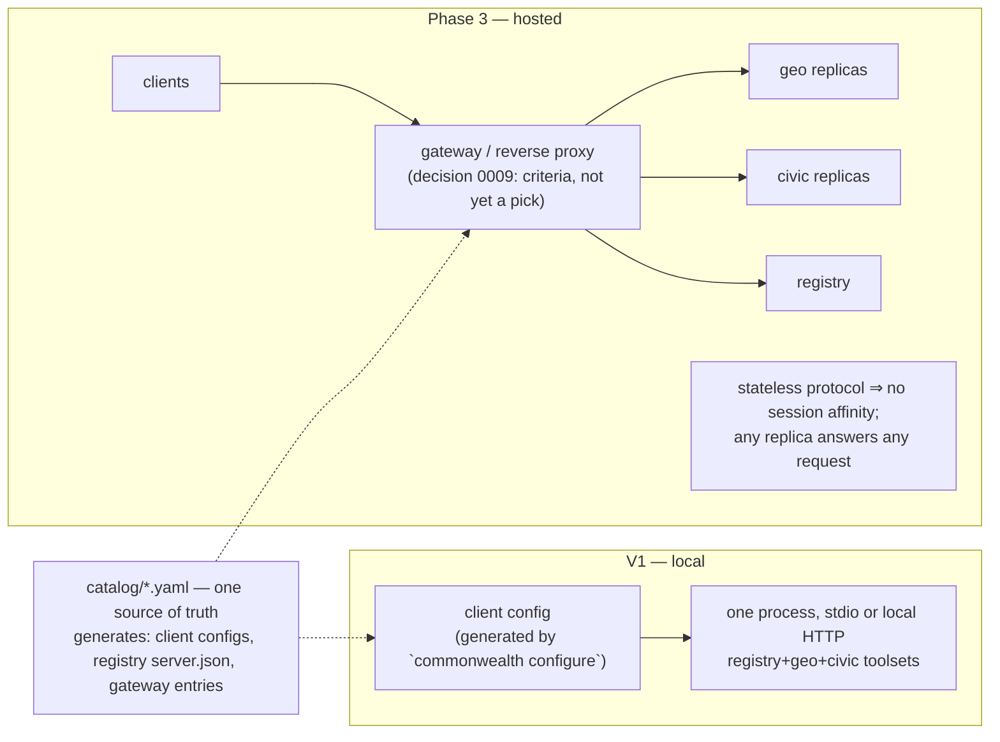

# Architecture

What Commonwealth-MCP is and how its pieces fit: the servers, the
provenance contract every answer carries, the source registry, the adapter
layer, and the phased plan.

This is the map. Three other places hold what it deliberately does not:

- **[DECISIONS.md](DECISIONS.md)** — why the architecture is shaped this
  way, with the alternatives that lost still written out.
- **[RESEARCH.md](RESEARCH.md)** — the evidence those decisions were made
  from.
- **[`design/`](design/README.md)** — the per-feature contracts. Each one
  expands a section below and is written to be read on its own; the code
  cites them by name.

Sections are numbered and referenced from code comments and specs as
"§ N", so the numbering is load-bearing — renumbering is a breaking change.

**Status:** Adopted, under implementation (updated 2026-08-28). Every blocking decision is Chosen (§ 35); the registry and geo packages, the envelope contract, and the first civic tool are built; § 33 and § 39 name what remains.  
**Audience:** Human architect, coding agents, open-source contributors  
**Snapshot date:** 2026-08-26  
**Revision note (2026-08-26, research pass):** This spec now has companion documents that carry its detail and its evidence. Read them where the spec points:

- `research/` — verified current state: [protocol-current-state.md](RESEARCH.md part 1) (the 2026-07-28 stateless spec revision and what it changes here), [mcp-ecosystem-survey.md](RESEARCH.md part 3) (exemplar repos, test patterns, the civic gap), [community-feedback.md](RESEARCH.md part 4) (practitioner findings with numbers).
- `design/` — per-feature contracts that expand this document's sections, and the architectural choices behind them: each decision has its options fleshed out, a recommendation, and (as of 2026-08-26) the architect's ruling (see [design/README.md](design/README.md)). § 34-35 of this spec now defer to those records.
- `ARCHITECTURE.md` — the flows, drawn.
- `DECISIONS.md review round 2` — the second review round (external automated review), whose contract corrections (coverage dimensions, evidence refs, cache-hint scope) and narrowed geo-first delivery plan are integrated throughout this spec's 2026-08-26 edits; `RESEARCH.md part 5` is its companion research (Data Commons, GovInfo, Census, Legistar/OpenStates/GTFS patterns, shared-core precedent).

**Ruling note (2026-08-26, architect pass):** all fourteen open decision records (0001-0008, 0010-0015) are now **Chosen** — see the status table in § 35. Only 0009 (hosted gateway) remains open, deliberately deferred to Phase 3. Two records were decided against their on-file recommendation: 0005 (source authority rules — the architect chose "always query both, never rank" over the recommended authority table) and 0015 (developer surfaces — the architect chose MCP-only over the recommended shared-core-as-library). Both deviations, and the backlogged options from 0008 and 0015, are recorded in their respective decision files. This spec's own prose (§ 5-33) still describes the pre-choice design space in places; where it conflicts with a Chosen decision file, the decision file wins — that gap is a documentation cleanup item, not a live ambiguity. See [CONTRIBUTING.md](CONTRIBUTING.md) for how to propose reopening a Chosen decision or suggest a new one.

Where this spec and a companion conflict, the companion is newer and wins; flag the conflict for cleanup rather than silently following either.

**Primary geography:** Commonwealth of Virginia, including state agencies, counties, independent cities, regional bodies, school divisions, constitutional officers, transit agencies, and other public entities  
**Long-term objective:** Establish a reusable semantic operating layer for state and local government data, with Virginia as the first fully modeled implementation

---

## 1. Executive Summary

Commonwealth-MCP should not be implemented as a collection of one-off MCP servers for every Virginia agency, locality, portal, or API.

The recommended architecture is a **federated domain-MCP ecosystem** with five distinct layers:

1. **Government Source Registry**  
   A declarative, machine-readable inventory of authoritative Virginia public systems, datasets, APIs, GIS services, portals, access requirements, update cadence, provenance, jurisdiction, and adapter mappings.

2. **Adapter and Commonwealth Core Layer**  
   Reusable protocol adapters (ArcGIS REST, Socrata, OGC API, OpenAPI, GTFS, Open311, Municode, Legistar, HTML/CSV/JSON) plus canonical civic data models, jurisdiction resolution, provenance, temporal semantics, pagination, caching, and evidence handling.

3. **Domain MCP Servers**  
   A small number of coherent, independently deployable MCP servers exposing semantic tools such as `geo.find_zoning`, `civic.search_legislation`, and `finance.search_procurements`. These servers should hide platform-specific schemas from agents.

4. **Commonwealth Skills**  
   Agent Skills that encode expert workflows: development-site due diligence, legislative impact analysis, project tracing, locality briefs, procurement scans, environmental permitting screens, and similar multi-source tasks.

5. **MCP Hub / Control Plane + Benchmarks**  
   A catalog/gateway for discovery, deployment, tenancy, credentials, versioning, health, policy, and selective tool exposure; plus an evaluation suite that measures whether agents use the tools correctly.

The recommended design synthesizes the strongest ideas observed across:
- PNNL `nepa-mcp`
- Power-Agent `PowerMCP`, `PowerSkills`, and `PowerAgentBench`
- GSA-TTS `mcp-server-hub-catalog`
- GitHub MCP Server
- Cloudflare domain-specific MCP servers and Code Mode MCP
- AWS MCP / Agent Toolkit patterns
- Context7
- Playwright MCP / CLI+Skills
- Official MCP reference servers

The core architectural principle is:

> **Separate the government source, the protocol adapter, the agent capability, and the expert workflow.**

Example:

```text
Government source:
  Fairfax County zoning ArcGIS layer

Adapter:
  ArcGIS REST

Agent capability:
  geo.find_zoning(location)

Expert workflow:
  development-site-due-diligence
```

Those four objects must evolve independently.

---

## 2. Goals and Non-Goals

### 2.1 Goals

Commonwealth-MCP should:

1. Provide agents with structured access to public Virginia state and local government data.
2. Normalize heterogeneous public systems behind stable semantic capabilities.
3. Preserve authoritative-source provenance and coverage limitations.
4. Support cross-source entity resolution and joins.
5. Scale across Virginia without creating one MCP server per locality.
6. Support both local developer use and centrally hosted multi-user deployment.
7. Make adding a new public source primarily a **configuration + mapping task** whenever possible.
8. Allow domain experts to contribute workflows without writing backend integration code.
9. Keep active tool surfaces small enough for reliable model selection.
10. Support repeatable evaluation of agent behavior and result quality.
11. Make read-only public data the default trust model.
12. Allow later extension to other states without embedding Virginia-specific assumptions into shared adapters and core schemas.

### 2.2 Non-Goals for V1

V1 should not:

- Submit permits, applications, public comments, service requests, bids, or other government transactions.
- Circumvent access controls, CAPTCHAs, rate limits, terms of use, or bulk-access restrictions.
- Treat publicly viewable web pages as automatically permitted for automated scraping.
- Attempt to create a universal ontology for every government record type.
- Guarantee legal conclusions from GIS intersections, dashboard data, or screening results.
- Replace agency determinations, official records, legal research, professional engineering judgment, or formal consultation.
- Build a bespoke MCP server for every Virginia locality or SaaS vendor.
- Depend on browser automation as the primary source ingestion strategy.

---

## 3. Design Principles

### 3.1 Authority Before Convenience

Prefer authoritative primary sources even if a secondary source is easier to query.

Every tool result should preserve:
- publisher,
- source system,
- dataset/layer,
- source record identifier where available,
- source update date where available,
- retrieval timestamp,
- transformations applied,
- geographic and temporal coverage,
- warnings and partial failures.

### 3.2 Semantic Tools, Boring Adapters

Protocol adapters should be generic and unsurprising.

Examples:
- ArcGIS REST client
- Socrata client
- OGC API client
- GTFS reader
- Open311 client
- OpenAPI client

Agent-facing tools should be semantic.

Prefer:

```text
geo.find_zoning(location)
```

over:

```text
arcgis.query_layer(url, layer_id, where, out_fields, geometry, spatial_rel)
```

Keep raw protocol operations as expert escape hatches, not as the default interface.

### 3.3 Progressive Disclosure

Do not expose every possible tool to every agent at once.

Use:
- domain toolsets,
- capability routing,
- skills,
- read-only profiles,
- task-specific activation,
- resources for large results,
- an expert explorer for long-tail sources.

### 3.4 Read-Only by Default

V1 should be overwhelmingly read-only.

For MCP tool annotations where supported:
- `readOnlyHint = true`
- `destructiveHint = false`

But security must not depend on annotations alone.

### 3.5 Evidence Over Confidence Scores

Do not attach arbitrary model confidence numbers to deterministic government data.

Instead return:
- provenance,
- coverage,
- warnings,
- source authority,
- freshness,
- transformation history,
- unresolved ambiguity.

### 3.6 Preserve Raw Source Payloads

Canonical models should normalize cross-source joins, but raw source fields should remain available as evidence or resources.

### 3.7 Human-Reviewable Architecture

Any automated coding agent should surface decisions that change:
- server boundaries,
- authority rules,
- access policy,
- schema semantics,
- source terms,
- write capabilities,
- data retention,
- identity resolution,
- licensing,
- deployment trust.

Those should not be silently inferred.

---

## 4. Architecture Overview

Commonwealth-MCP should be modeled as three planes plus a shared data foundation.

```text
                               AGENT / USER
                                   │
                                   ▼
                       ┌─────────────────────┐
                       │  COMMONWEALTH HUB   │
                       │                     │
                       │ catalog             │
                       │ capability routing  │
                       │ toolset selection   │
                       │ auth / tenancy      │
                       │ versions / health   │
                       │ policy              │
                       └─────────┬───────────┘
                                 │
                ┌────────────────┼────────────────┐
                │                │                │
                ▼                ▼                ▼
          COMMONWEALTH      COMMONWEALTH     EXTERNAL MCPs
              GEO               CIVIC        e.g. NEPA-MCP
                │                │
             tools            tools
                │                │
                └────────┬───────┘
                         ▼
                 COMMONWEALTH CORE
                         │
             canonical civic entities
             provenance / evidence
             jurisdiction identity
             temporal state
             caching / pagination
                         │
          ┌──────────────┼──────────────┐
          ▼              ▼              ▼
       ADAPTERS        ADAPTERS       ADAPTERS
       ArcGIS          Socrata        OGC
       OpenAPI         GTFS           Open311
       Municode        Legistar       HTML/CSV
                         │
                         ▼
            GOVERNMENT SOURCE REGISTRY
                         │
        ┌────────────────┼─────────────────┐
        ▼                ▼                 ▼
      STATE           LOCALITIES         REGIONAL
      VGIN             Fairfax           transit
      VDOT             Loudoun           PDCs
      DEQ              Richmond          utilities
      LIS              ...
```

The **Skill Plane** sits above the domain MCPs:

```text
Commonwealth Skills
├── development-site-due-diligence
├── locality-brief
├── legislative-impact-analysis
├── project-trace
├── procurement-market-scan
├── environmental-permitting-screen
├── infrastructure-access-screen
└── public-meeting-and-decision-trace
```

The **Evaluation Plane** validates the behavior of agents using the system:

```text
Commonwealth Bench
├── source-selection
├── jurisdiction-resolution
├── tool-selection
├── entity-resolution
├── spatial-correctness
├── temporal-correctness
├── provenance
├── coverage-awareness
├── workflow-completeness
└── unsupported-inference
```

---

## 5. Architectural Options Considered

### Option A — Single Monolithic Commonwealth MCP

#### Shape

One MCP server exposes all Commonwealth tools.

```text
commonwealth-mcp
├── registry tools
├── geo tools
├── civic tools
├── finance tools
├── environment tools
├── infrastructure tools
└── people tools
```

#### Advantages

- Simplest client installation.
- Simplest early development.
- One auth and deployment model.
- Easy in-process cross-domain joins.
- Straightforward shared cache.

#### Disadvantages

- Large tool surface.
- Broad dependency graph.
- One failure can affect unrelated domains.
- Harder to isolate credentials.
- Harder to version independent domains.
- Encourages giant abstractions.
- Less suitable for community ownership by domain.

#### Recommended use

Acceptable for an early proof of concept, but **not recommended as the long-run architecture**.

---

### Option B — One MCP Server Per Source / Agency / Locality

#### Shape

```text
mcp-lis
mcp-vdot
mcp-deq
mcp-fairfax
mcp-loudoun
mcp-richmond
...
```

#### Advantages

- Strong source isolation.
- Simple ownership.
- Strong provenance boundaries.
- Easy independent deployment.

#### Disadvantages

- Explodes at Virginia scale.
- Duplicates ArcGIS/Socrata/HTTP logic.
- Pushes cross-source orchestration onto the agent.
- Tool-selection becomes difficult.
- Locality onboarding requires code instead of manifests.
- Creates high operational burden.

#### Recommended use

Only for sources with genuinely unique:
- authentication,
- runtime dependencies,
- stateful workflows,
- legal/terms constraints,
- specialized semantics.

**Do not use this as the default topology.**

---

### Option C — Federated Domain MCPs + Shared Core + Source Registry

#### Shape

```text
commonwealth-registry
commonwealth-geo
commonwealth-civic
commonwealth-finance
commonwealth-infrastructure
commonwealth-environment
commonwealth-people
```

Each domain uses:
- shared adapters,
- shared canonical models,
- declarative source manifests.

#### Advantages

- Good semantic boundaries.
- Tool surfaces remain manageable.
- Independent deployment/versioning.
- Avoids one-server-per-locality proliferation.
- Source onboarding can often be configuration-only.
- Works well with a gateway/catalog.
- Supports cross-source domain joins.
- Aligns with open-source contribution boundaries.

#### Disadvantages

- Requires careful shared-core design.
- Cross-domain workflows must be composed by skills or orchestration.
- Some sources may fit multiple domains.
- Requires governance for canonical entities.

#### Recommendation

**Recommended primary architecture.**

---

### Option D — Code-Mode / Dynamic Explorer First

#### Shape

A few generic tools dynamically inspect source schemas and execute queries.

```text
source.search
source.inspect
source.query
```

#### Advantages

- Very low MCP schema token cost.
- Rapid long-tail source coverage.
- Useful for undocumented/unknown APIs.
- Good for developers and advanced agents.
- Avoids premature modeling.

#### Disadvantages

- More reasoning burden on the agent.
- Lower determinism.
- Harder to evaluate.
- Harder to guarantee source semantics.
- Easier to make unsafe or invalid assumptions.
- Less approachable for end-user civic tasks.

#### Recommendation

Use as **Commonwealth Explorer**, an expert fallback, not as the default user interface.

---

## 6. Recommended Architecture

Adopt **Option C** with selected elements of Options A and D:

1. **Federated domain MCP servers** as the production boundary.
2. **One Hub / catalog UX** so users do not manage many servers manually.
3. **Commonwealth Explorer** for long-tail or not-yet-normalized sources.
4. **Shared Commonwealth Core** for provenance, jurisdiction, canonical entities, and source resolution.
5. **Skills** for multi-source workflows.
6. **Benchmarks** for agent reliability.
7. **Declarative source manifests** instead of locality-specific code wherever possible.

The recommended pattern is:

> PNNL data discipline + Power-Agent layering + GSA-style control plane + GitHub toolsets + Cloudflare-style expert escape hatch.

---

## 7. Server Boundaries

### 7.1 Initial Servers

#### `commonwealth-registry`

Responsibilities:
- resolve jurisdictions,
- search government sources,
- identify authoritative sources,
- inspect source metadata,
- inspect capability coverage,
- report source health/freshness,
- support capability routing.

Suggested tools:

```text
registry.resolve_jurisdiction
registry.search_sources
registry.describe_source
registry.find_authoritative_source
registry.list_capabilities
registry.source_status
```

#### `commonwealth-geo`

Responsibilities:
- parcel lookup,
- boundaries,
- zoning,
- spatial intersection,
- buffers,
- nearby features,
- geospatial source discovery.

Suggested tools:

```text
geo.resolve_location
geo.find_parcel
geo.find_boundaries
geo.find_zoning
geo.find_nearby
geo.intersect
geo.buffer
geo.query_source
```

#### `commonwealth-civic`

Responsibilities:
- legislation,
- state law,
- regulations,
- elections,
- campaign finance,
- public meetings,
- local ordinances.

Suggested tools:

```text
civic.search_legislation
civic.get_bill
civic.get_vote
civic.search_law
civic.search_regulations
civic.search_meetings
civic.get_agenda_item
civic.search_campaign_finance
civic.get_election_results
```

#### `commonwealth-finance`

Responsibilities:
- procurement,
- contracts,
- vendors,
- budgets,
- expenditures,
- awards.

Suggested tools:

```text
finance.search_procurements
finance.get_contract
finance.find_vendor
finance.search_awards
finance.query_expenditures
finance.get_budget
```

#### `commonwealth-infrastructure`

Responsibilities:
- roads,
- transit,
- broadband,
- public infrastructure,
- sites,
- capital projects,
- real-time transportation where permitted.

Suggested tools:

```text
infrastructure.search_projects
infrastructure.get_road_conditions
infrastructure.find_transit
infrastructure.find_sites
infrastructure.find_broadband
infrastructure.find_public_assets
```

#### `commonwealth-environment`

Responsibilities:
- DEQ facilities and permits,
- flood screening,
- natural resources,
- energy resources,
- environmental constraints,
- water-related public data.

Suggested tools:

```text
environment.search_facilities
environment.find_permits
environment.screen_flood
environment.screen_constraints
environment.find_energy_resources
environment.find_water_assets
```

#### `commonwealth-people`

V1 umbrella domain for:
- education,
- workforce,
- public health,
- licenses,
- human services,
- business entities.

Suggested tools:

```text
people.get_school_profile
people.search_professional_license
people.get_labor_market
people.get_health_indicator
people.find_human_services
people.search_business_entity
```

This server may later split into:
- `commonwealth-education`
- `commonwealth-workforce`
- `commonwealth-health`
- `commonwealth-licensing`

only when tool count, dependencies, or ownership justify separation.

---

## 8. Server Promotion Rule

Start with logical toolsets.

Promote a toolset to an independently deployable server when one or more of these are true:

1. Different authentication model.
2. Different trust or access level.
3. Different runtime dependencies.
4. Different scaling characteristics.
5. Different release cadence.
6. Distinct maintainers/ownership.
7. Significant tool count.
8. Significant fault isolation requirement.
9. Data-handling or legal restrictions.
10. Stateful or transactional behavior.

Do **not** split because two tools come from different agencies.

---

## 9. Commonwealth Core

Commonwealth Core is the shared interoperability layer.

It should contain:

```text
commonwealth_core/
├── models/
├── provenance/
├── jurisdiction/
├── temporal/
├── identity/
├── geo/
├── pagination/
├── caching/
├── auth/
├── source_resolution/
├── errors/
└── resources/
```

### 9.1 Canonical Entities

Do not create a universal government ontology.

Start with entities necessary for cross-source joins:

```text
Jurisdiction
Agency
Organization
Location
Parcel
Facility
Project
Permit
PlanningCase
GovernmentAction
LegislativeItem
Procurement
License
InfrastructureAsset
Observation
Evidence
Source
TemporalState
```

#### Example `PlanningCase`

```json
{
  "type": "PlanningCase",
  "id": "fairfax:rz-2026-00123",
  "jurisdiction": {
    "id": "va:fairfax-county",
    "fips": "51059"
  },
  "canonical": {
    "case_number": "RZ-2026-00123",
    "status": "scheduled",
    "applicant": "Example Development LLC",
    "location": {
      "address": "..."
    }
  },
  "source": {
    "source_id": "va-fairfax-planning-cases",
    "publisher": "Fairfax County",
    "record_id": "..."
  },
  "temporal": {
    "retrieved_at": "2026-08-26T...",
    "source_updated_at": "...",
    "effective_at": "..."
  },
  "coverage": {
    "status": "complete",
    "warnings": []
  },
  "raw": {
    "...": "original source fields"
  }
}
```

### 9.2 Canonical IDs

Use stable namespaced IDs.

Examples:

```text
va:fairfax-county
va:richmond-city
va:agency:deq
va:lis:bill:2026:hb1234
va:fairfax:parcel:<local-id>
va:fairfax:planning:<case-id>
```

Do not invent national uniqueness schemes before needed.

### 9.3 Jurisdiction Resolution

Jurisdiction resolution is foundational.

Inputs may include:
- name,
- address,
- coordinates,
- FIPS,
- ZIP,
- parcel,
- locality alias.

Outputs should include:
- canonical jurisdiction ID,
- jurisdiction type,
- FIPS where applicable,
- parent state,
- confidence/ambiguity expressed as resolvable alternatives rather than arbitrary probability where possible.

---

## 10. Provenance and Evidence Contract

Every semantic tool result should follow a common envelope:

```json
{
  "data": {},
  "provenance": [],
  "evidence": [],
  "coverage": {},
  "warnings": [],
  "next_actions": []
}
```

### 10.1 Provenance and Evidence Fields

(Revised 2026-08-26: split into linked source entries and evidence objects so mixed-source results prove which source supports which record — full contract in design/provenance-envelope.md § 2.)

Source entries, at minimum:

```text
id                    (response-local, e.g. source_01)
publisher
source_id
system
dataset_or_layer
jurisdiction
authority_level
access_path           (live | cache | index)
source_updated_at
retrieved_at
cache_age_seconds
```

Evidence objects, at minimum:

```text
id                    (response-local, e.g. evidence_01)
source_ref
record_id
locator               (stable human-openable URL, omitted when none exists — never guessed)
retrieved_at
effective_at
transformations
payload_hash          (when raw retention permitted)
raw_recovery          (available | forbidden_by_terms | expired)
```

Every material record in `data` carries `evidence_refs`; an unreferenced claim is a contract-test failure.

### 10.2 Coverage Fields

(Revised 2026-08-26: the single `status` enum conflated independent questions; coverage is now dimensions — full table in design/provenance-envelope.md § 3.)

```text
registry:      covered | partial | none | unknown
execution:     complete | partial | failed
pagination:    complete | truncated | unknown
source_claim:  complete | partial | unknown
result:        hit | empty        (empty is a successful state, not an error)

jurisdictions_searched / jurisdictions_unavailable
time_range
source_failures
known_limitations
```

### 10.3 Execution Provenance

Also capture:

```text
server
server_version
tool
tool_contract_version
adapter
adapter_version
catalog_revision
request_timestamp
```

Data provenance and execution provenance must be distinguishable.

### 10.4 Authority Levels

Suggested values:

```text
primary
official_secondary
official_derived
third_party
unverified
```

Do not equate `primary` with legal dispositiveness.

---

## 11. Government Source Registry

The Government Source Registry is a core open-source asset.

It answers:

> What public system contains this information, who publishes it, how do I access it, how current is it, and how should it map into Commonwealth capabilities?

### 11.1 Example Manifest

```yaml
id: va-fairfax-zoning
name: Fairfax County Zoning
jurisdiction: va:fairfax-county

publisher:
  agency: Fairfax County Department of Planning and Development
  authority_level: primary

domain:
  - geo
  - planning

capabilities:
  - zoning.lookup
  - zoning.spatial_intersection

adapter:
  type: arcgis
  service_url: https://example.gov/arcgis/rest/services/Planning/Zoning/FeatureServer
  layers:
    zoning:
      id: 4
      field_mapping:
        district: ZONING
        object_id: OBJECTID

access:
  mode: anonymous
  authentication: none
  automation_status: permitted
  pii_risk: low

freshness:
  expected_update: daily
  last_verified_at: 2026-08-26T00:00:00Z

authority:
  notes: >
    GIS representation is useful for screening. Confirm controlling adopted
    zoning records when a legal determination is required.

coverage:
  geography: va:fairfax-county
  temporal: current

terms:
  source_terms_url: https://...
  notes: ...

health:
  probe:
    type: arcgis-layer-info
```

### 11.2 Source Manifest Requirements

Every source must include:

- canonical ID,
- publisher,
- jurisdiction,
- domain,
- capabilities,
- adapter,
- access/auth,
- source authority,
- update/freshness,
- coverage,
- terms/automation notes,
- field mappings,
- last verification,
- health probe.

### 11.3 Source Contribution Workflow

A typical locality contribution should be:

```text
1. Add YAML manifest
2. Validate schema
3. Run endpoint health checks
4. Run field-mapping contract tests
5. Run sample semantic tool tests
6. Add fixture
7. Review authority/terms notes
8. Merge
```

Prefer this over writing a new server.

---

## 12. Adapter Layer

Initial adapters:

```text
arcgis
socrata
ogc
openapi
gtfs
open311
municode
legistar
csv_json
html_download
```

Potential later adapters:

```text
civicclerk
boarddocs
opengov
accela
energov
etrakit
powerbi_export
tableau_export
```

### 12.1 Adapter Contract

Every adapter should support a common minimum interface where applicable:

```text
discover()
describe()
query()
paginate()
health()
normalize_errors()
```

Spatial adapters additionally:

```text
query_geometry()
intersect()
buffer_or_delegate()
```

### 12.2 Escape Hatch

Adapters may expose raw calls internally, but domain servers should only expose raw source query tools where needed.

Example:

```text
geo.query_source(source_id, query)
```

This should:
- restrict requests to registered sources,
- validate query structure,
- enforce allowed operations,
- return provenance,
- avoid arbitrary outbound HTTP.

---

## 13. Commonwealth Explorer

Commonwealth Explorer is the long-tail integration path inspired by code-mode patterns.

It should be a separate, opt-in expert capability.

Suggested tools:

```text
explorer.search_sources
explorer.inspect_schema
explorer.query_source
explorer.explain_mapping
```

Potential later tool:

```text
explorer.execute_readonly
```

only if sandboxing and source allowlists are strong.

### 13.1 Purpose

Use Explorer when:
- a source is newly discovered,
- a source is not yet mapped to a semantic tool,
- an agent needs an unusual field,
- contributors are developing a source manifest,
- a source exposes a huge OpenAPI/ArcGIS surface.

### 13.2 Promotion Path

Repeated Explorer usage should inform normalization.

```text
exploratory query
      ↓
useful recurring pattern
      ↓
source mapping
      ↓
semantic capability
      ↓
stable domain tool
      ↓
skill integration
```

---

## 14. MCP Hub / Control Plane

The Hub is conceptually separate from the Government Source Registry.

The Hub answers:

> Which MCP servers are available, how are they deployed, what tools/capabilities do they expose, how are credentials handled, and which server should an agent activate?

### 14.1 Internal MCP Catalog Entry

Do not make an external gateway schema the canonical internal representation.

Use a richer Commonwealth schema and export to:
- GSA/Obot-style catalogs,
- official MCP Registry metadata,
- client configs,
- plugin manifests.

Example:

```yaml
id: commonwealth-geo
display_name: Commonwealth Geo
version: 0.1.0

runtime:
  type: remote
  endpoint: https://mcp.commonwealth.example/geo/mcp
  health: https://mcp.commonwealth.example/geo/health

tenancy:
  mode: shared

access:
  classification: public
  read_only: true

capabilities:
  - id: parcel.lookup
    tool: geo.find_parcel
  - id: zoning.lookup
    tool: geo.find_zoning

toolsets:
  default:
    - geo.resolve_location
    - geo.find_parcel
    - geo.find_zoning
    - geo.find_boundaries
  all:
    - "*"

dependencies:
  source_capabilities:
    - parcel.lookup
    - zoning.lookup

risk:
  level: low
```

### 14.2 Tenancy

Use:

```text
shared
per-user
```

Typical V1 mapping:

#### Shared
- VGIN public services
- VDOT public GIS
- Virginia Open Data
- VEDP public OGC
- Virginia Law
- public local GIS
- static GTFS

#### Per-user
- APIs requiring personal keys
- sources requiring individual authorization
- future restricted systems
- future write capabilities

### 14.3 Runtime

Support:

```text
remote
managed-container
local-stdio
```

Recommended production default:
- Streamable HTTP remote or managed service.

Recommended developer default:
- local stdio or local Streamable HTTP.

---

## 15. Toolset Exposure

The ecosystem may contain more than 100 tools eventually.

The active agent context should contain 8–12 tools per profile, with a hard task-profile ceiling of 20 — the numbers DECISIONS.md 0002 chose and `core/toolreg.py` enforces. (History: this paragraph said "20–50", was revised 2026-08-26 to "12–25" on the measured accuracy cliffs, and still said "12–25" after 0002 settled on 8–12/20; corrected 2026-08-28. The measurements: selection accuracy falls below 90% at 10–15 tools for small models and 20–30 for mid-tier ones, and Anthropic's own guidance flags degradation past 30–50 — RESEARCH.md part 4 § 1. 0002 also covers deferred loading / tool search as the growth path.)

Support:
- default toolsets,
- domain toolsets,
- task-specific toolsets,
- read-only toolsets,
- expert/all toolsets.

Example logical profiles:

```text
default
development
civic
geo
environment
finance
infrastructure
all
```

A development task might activate (example corrected 2026-08-28 — the previous one summed to ~28 tools, and a profile that size fails startup under 0002's ceiling; task profiles pick 3–6 tools per domain rather than taking every domain's full default set):

```text
registry: 2 tools
geo: 5 tools
civic: 4 tools
environment: 4 tools
infrastructure: 3 tools
```

Total: 18 tools, inside the ceiling of 20.

---

## 16. MCP Resources

Use MCP resources for large, durable, or reusable context.

Examples:

```text
commonwealth://sources/{source_id}
commonwealth://jurisdictions/{jurisdiction_id}
commonwealth://results/{result_id}
commonwealth://results/{result_id}.geojson
commonwealth://schemas/{entity}
commonwealth://evidence/{evidence_id}
commonwealth://provenance/{record_id}
```

Tools should summarize large results and return resource handles rather than dumping huge payloads into the model context.

Example:

```json
{
  "data": {
    "record_count": 2834,
    "jurisdictions": 4
  },
  "resources": [
    "commonwealth://results/01JXYZ",
    "commonwealth://results/01JXYZ.geojson"
  ]
}
```

---

## 17. Skills Architecture

Skills encode professional workflows, not source manuals.

Avoid skills named:
- `vdot`
- `deq`
- `fairfax`
- `lis`

Prefer outcome-oriented skills.

### 17.1 Initial Skills

#### `development-site-due-diligence`

Workflow:

1. Establish project geometry.
2. Resolve jurisdiction.
3. Identify parcels.
4. Retrieve zoning.
5. Retrieve comp-plan/planning context where available.
6. Retrieve pending and approved planning cases.
7. Trace public meetings and formal actions.
8. Screen environmental and flood constraints.
9. Identify transportation, broadband, and other infrastructure.
10. Search relevant state regulatory actions.
11. Classify project stage:
   - rumor/unverified,
   - announced,
   - application filed,
   - permit pending,
   - approved,
   - construction,
   - operational.
12. Produce evidence matrix and unresolved gaps.

#### `legislative-impact-analysis`

1. Resolve bill and version.
2. Determine current status.
3. Retrieve amendments.
4. Retrieve votes.
5. Retrieve fiscal impacts.
6. Resolve Code sections affected.
7. Retrieve current Code text.
8. Search related regulations.
9. Identify responsible agencies.
10. Identify locality implications.
11. Distinguish enacted law from proposed language.

#### `locality-brief`

1. Resolve locality.
2. Basic demographics/economy.
3. Budget and expenditures.
4. Procurements.
5. Capital projects.
6. Planning/development.
7. Transportation.
8. Schools.
9. Elections/governance.
10. Environmental constraints.
11. Recent major public meetings/actions.

#### `project-trace`

Given a company/project/site:
1. Resolve organizations and aliases.
2. Resolve parcel/location.
3. Match planning records.
4. Match DEQ/environmental permits.
5. Match public meetings.
6. Match procurement/incentives where available.
7. Match transportation/infrastructure.
8. Match state/local regulatory records.
9. Construct chronology.
10. Report ambiguous matches separately.

#### `procurement-market-scan`

1. Define procurement concept and aliases.
2. Search state solicitations.
3. Search awards.
4. Search expenditure data.
5. Search configured local systems.
6. Normalize vendor identities.
7. Distinguish solicitation, award, contract, and payment.
8. Report gaps due to portal coverage.

#### `environmental-permitting-screen`

1. Establish ROI.
2. Identify relevant Virginia environmental sources.
3. Query permits/facilities.
4. Query flood/resource constraints.
5. Invoke federal NEPA-MCP sources where appropriate.
6. Distinguish screening results from agency determinations.
7. Report failed/partial sources.

#### `public-meeting-and-decision-trace`

1. Resolve governing body.
2. Search agenda systems.
3. Retrieve agenda items.
4. Retrieve attachments/packets where permitted.
5. Retrieve votes/minutes.
6. Link planning cases or projects.
7. Distinguish discussion from formal action.
8. Produce chronology with citations/evidence.

---

## 18. Skill Escalation Logic

Every workflow skill should include explicit escalation triggers.

Example:

| Finding | Escalate |
|---|---|
| Parcel intersects floodway | flood-risk workflow |
| Rezoning is pending | planning-case trace |
| State environmental permit found | permitting trace |
| Federal funding/action identified | NEPA/federal compliance workflow |
| SCC docket references utility upgrade | utility-regulatory workflow |
| Historic resource near ROI | cultural-resource screen |
| Source coverage partial | source-verification workflow |
| Conflicting parcel identifiers | identity-resolution workflow |

Escalation should be driven by findings, not by calling every available tool.

---

## 19. Authentication and Security

### 19.1 V1 Posture

Target:

```text
public
shared
read-only
low-risk
```

### 19.2 Access Classes

```text
public
authenticated-public
restricted
```

### 19.3 Credential Modes

```text
none
service-shared
per-user-api-key
oauth
other-user-auth
```

Note added 2026-08-26: anonymous public access is a feature to preserve as long as possible (auth friction is the ecosystem's #1 remote-server complaint). When authenticated tiers arrive (Gate D), target Enterprise-Managed Authorization (EMA/ID-JAG, a stable MCP extension) for institutional users and Client ID Metadata Documents for client registration — Dynamic Client Registration is deprecated at the protocol level. See RESEARCH.md part 1 § 1, § 7 and RESEARCH.md part 4 § 5.

### 19.4 Write Separation

If future transaction tools are added:

```text
Commonwealth Public Data MCP
```

must remain logically and ideally operationally separate from:

```text
Commonwealth Actions MCP
```

Examples of future actions:
- submit service request,
- submit public comment,
- file application,
- update a case,
- schedule inspection.

Those require:
- user identity,
- explicit authorization,
- audit trail,
- idempotency,
- human confirmation policy,
- stronger threat model.

---

## 20. Legal, Terms, and Automation Policy

Every source manifest must include an automation status:

```text
permitted
public_api
public_download
manual_review_required
restricted
do_not_automate
unknown
```

Rules:

1. Public visibility alone does not imply automation permission.
2. Where an official API exists, prefer it.
3. Where bulk downloads exist, prefer them over scraping.
4. Do not bypass anti-bot mechanisms.
5. Do not treat restricted court/CAD/land-record systems as ordinary open data.
6. Store terms notes with the source.
7. Require human architect review before enabling questionable automation.

---

## 21. Caching and Freshness

### 21.1 Cache by Source Semantics

Examples:

- static GIS metadata: hours/days
- current legislative status: minutes
- traffic: seconds/minutes
- election results on election night: short TTL
- historical budget data: long TTL

### 21.2 Freshness Metadata

Every result should distinguish:
- source effective/update time,
- retrieval time,
- cache age.

### 21.3 Cache Invalidation

Use:
- TTL,
- ETag/Last-Modified where available,
- source-specific update schedule,
- manual invalidation,
- versioned source manifests.

### 21.4 Protocol-Native Cache Hints (added 2026-08-26; corrected same day)

The 2026-07-28 spec requires `ttlMs` and `cacheScope` on **list/read results** (`tools/list`, `resources/read`, and peers via `CacheableResult`) — **not on ordinary `tools/call` results** (correction per the 2026-08-26 architecture review § 2.3; the changelog's own list confirms it). Consequences: source freshness on tool results remains the Commonwealth envelope's job (`retrieved_at`, `cache_age_seconds`, `source_updated_at`); protocol cache hints apply where they exist — result *resources* served via `resources/read` declare `ttlMs` from manifest `ttl_hint_seconds` and `cacheScope: "public"` for the public surface, and tool listings declare long TTLs. ETags for tool results are on the protocol roadmap; adopt when shipped. See RESEARCH.md part 1 § 1.

---

## 22. Error Model

Normalize errors into typed categories (revised 2026-08-26 with the dimensional coverage model — design/provenance-envelope.md § 3):

```text
SourceUnavailable
AuthenticationRequired
AuthorizationDenied
RateLimited
SourceSchemaChanged
InvalidQuery
AmbiguousEntity
UnsupportedJurisdiction
TermsRestricted
```

`NoResults`, `NoCoverage`, and `PartialResults` are no longer errors: an empty match is `coverage.result: "empty"`, a registry gap is `coverage.registry: "none"`, and a partial run is `coverage.execution: "partial"` — all successful responses whose coverage dimensions carry the distinction. Errors are reserved for conditions that prevent a valid answer.

The original rule survives in stronger form: an empty result, a registry gap, and a source outage must never read the same, and the coverage dimensions make collapsing them a schema violation rather than a discipline. That distinction is critical for government research.

---

## 23. Observability

For every tool call record:

```text
request_id
server
server_version
tool
tool_contract_version
source_ids
adapter
latency
cache_status
records_returned
pagination_status
partial_failures
auth_mode
timestamp
```

Do not log:
- secrets,
- unnecessary personal data,
- restricted raw records.

Adopt OpenTelemetry conventions rather than a bespoke logging story: the 2026-07-28 spec documents OTel trace-context propagation in `_meta` (`traceparent`/`tracestate`), protocol-level logging is deprecated, and the surveyed production servers (grafana, osmmcp, ContextForge) all standardized on OTel. (Added 2026-08-26.)

Metrics should include:
- tool success rate,
- source health,
- schema-change failures,
- rate limits,
- partial result rate,
- average records,
- agent tool-selection patterns in evals.

---

## 24. Repository Strategy

### 24.1 Recommended Initial Repositories

#### Repository 1 — `commonwealth-mcp`

Contains:
- servers,
- core models,
- adapters,
- source registry,
- initial skills,
- tests,
- evals.

Suggested shape:

```text
commonwealth-mcp/
├── pyproject.toml
├── README.md
├── SECURITY.md
├── CONTRIBUTING.md
│
├── src/commonwealth/
│   ├── cli/
│   ├── core/
│   │   ├── models/
│   │   ├── provenance/
│   │   ├── jurisdiction/
│   │   ├── temporal/
│   │   ├── identity/
│   │   └── errors/
│   ├── adapters/
│   │   ├── arcgis/
│   │   ├── socrata/
│   │   ├── ogc/
│   │   ├── openapi/
│   │   ├── gtfs/
│   │   ├── open311/
│   │   ├── municode/
│   │   └── legistar/
│   ├── servers/
│   │   ├── registry/
│   │   ├── geo/
│   │   ├── civic/
│   │   ├── finance/
│   │   ├── infrastructure/
│   │   ├── environment/
│   │   └── people/
│   └── explorer/
│
├── sources/
│   ├── state/
│   ├── local/
│   └── regional/
│
├── skills/
│   ├── development-site-due-diligence/
│   ├── locality-brief/
│   ├── legislative-impact-analysis/
│   ├── project-trace/
│   └── procurement-market-scan/
│
├── tests/
│   ├── unit/
│   ├── adapters/
│   ├── contracts/
│   ├── sources/
│   └── tools/
│
└── evals/
    ├── tasks/
    ├── fixtures/
    ├── scorers/
    └── baselines/
```

#### Repository 2 — `commonwealth-mcp-catalog`

Contains:
- MCP deployment catalog,
- gateway manifests,
- runtime metadata,
- tenancy,
- credential declarations,
- health checks,
- version pinning,
- exported GSA/Obot-compatible entries if desired.

Suggested shape:

```text
commonwealth-mcp-catalog/
├── README.md
├── schema/
│   └── catalog.schema.json
├── servers/
│   ├── commonwealth-registry.yaml
│   ├── commonwealth-geo.yaml
│   ├── commonwealth-civic.yaml
│   ├── commonwealth-finance.yaml
│   └── commonwealth-environment.yaml
├── external/
│   └── pnnl-nepa-mcp.yaml
├── policies/
│   ├── public-readonly.yaml
│   └── authenticated.yaml
└── tests/
```

### 24.2 Later Repository Split

When the contributor ecosystem grows:

```text
CommonwealthSkills
CommonwealthBench
CommonwealthRegistry
```

may become separate repositories.

Do not split them prematurely.

---

## 25. CLI

Provide a strong CLI.

Suggested commands:

```bash
pipx install commonwealth-mcp

commonwealth install
commonwealth doctor

commonwealth serve
commonwealth serve --servers registry,geo,civic

commonwealth tools list
commonwealth tools list --server geo

commonwealth sources search zoning
commonwealth sources inspect va-fairfax-zoning
commonwealth sources validate sources/local/fairfax/zoning.yaml
commonwealth sources verify va-fairfax-zoning

commonwealth catalog list
commonwealth catalog inspect commonwealth-geo
commonwealth catalog health

commonwealth configure claude
commonwealth configure codex
commonwealth configure vscode
```

Contributor commands:

```bash
commonwealth source scaffold arcgis
commonwealth source validate <manifest>
commonwealth source test <manifest>
commonwealth eval run development-site
```

---

## 26. Packaging and Transport

### 26.1 Python

Recommended initial implementation:
- Python 3.12+
- Server framework per DECISIONS.md 0003 — "FastMCP" now names two different things (the official SDK v2 renamed its bundled class to `MCPServer`; standalone FastMCP is at 3.4.7/4.0-beta), so the choice is a recorded decision, pinned exactly, never the bare word.
- Pydantic 2
- httpx
- shapely / pyproj only where needed
- uv for development
- pipx/uvx for installation

This aligns with the strongest observed government-data implementation patterns and minimizes contributor friction. (PNNL's nepa-mcp, the closest domain analog, runs Python 3.12 + standalone FastMCP 3.4.x as of 2026-08.)

### 26.2 Transports

Support:
- stdio for local developer clients,
- Streamable HTTP for hosted deployment.

Do not build new functionality around deprecated SSE patterns.

Design constraint added 2026-08-26: the 2026-07-28 protocol revision made MCP stateless (no sessions, no initialize handshake; `server/discover`; per-request `_meta`). Build servers stateless from the start — cross-call state is explicit server-minted handles (result resources, cursors) passed as tool arguments, and any replica can answer any request. See RESEARCH.md part 1 § 1.

### 26.3 Containerization

Every hosted server should:
- expose `/mcp`,
- expose `/health`,
- have pinned image versions,
- run non-root where practical,
- support configuration through environment/secrets,
- avoid embedding credentials.

---

## 27. Tool Contract Guidelines

Every semantic tool should have:

1. Short action-oriented name.
2. Clear description of when to use it.
3. Small number of meaningful parameters.
4. Stable typed response.
5. Provenance.
6. Coverage.
7. Warnings.
8. Pagination semantics.
9. Resource handles for large payloads.
10. Explicit ambiguity behavior.

Avoid parameters that merely mirror vendor APIs.

Bad:

```text
where
outFields
spatialRel
returnGeometry
f
```

Better:

```text
location
jurisdiction
date_range
status
include_geometry
```

---

## 28. Source Selection Algorithm

Semantic tools should not hard-code one source when multiple jurisdictions are possible.

High-level algorithm:

```text
1. Resolve jurisdiction
2. Resolve requested capability
3. Query Source Registry
4. Rank sources:
   a. jurisdiction match
   b. capability match
   c. authority
   d. health
   e. coverage
   f. freshness
5. Select primary source
6. Optionally query secondary official source for reconciliation
7. Normalize
8. Return provenance + coverage
```

Do not silently reconcile conflicting official records. Return the conflict.

---

## 29. Entity Resolution

Entity resolution is a strategic capability.

V1 should support:
- organization names/aliases,
- project names,
- parcel IDs,
- case numbers,
- vendor names,
- bill IDs,
- permit IDs.

Keep matches explicit:

```json
{
  "entity": "...",
  "matches": [
    {
      "source_id": "...",
      "record_id": "...",
      "match_basis": [
        "exact_case_number",
        "same_parcel"
      ]
    }
  ],
  "ambiguities": []
}
```

Avoid opaque probabilistic linking where deterministic identifiers exist.

---

## 30. Cross-Source Chronology

A major differentiator should be a reusable event model.

Canonical `GovernmentAction` / `Observation` should allow chronology such as:

```text
2025-03-14 planning application filed
2025-05-02 staff report issued
2025-06-20 planning commission hearing
2025-07-15 board approval
2025-08-03 DEQ permit issued
2026-01-10 construction activity observed
```

Every event needs:
- source,
- date type,
- subject/entity,
- action type,
- status,
- evidence.

---

## 31. Tool and Skill Evaluation

### 31.1 Commonwealth Bench

Create benchmark tasks from real Virginia questions.

Score:

| Dimension | Example |
|---|---|
| Source selection | Did the agent pick the authoritative locality source? |
| Jurisdiction | Did it distinguish Fairfax County from Fairfax City? |
| Tool selection | Did it use zoning rather than generic web search? |
| Argument correctness | Correct parcel/location/date range? |
| Entity resolution | Correct project/vendor/company? |
| Spatial correctness | Correct containment/intersection? |
| Temporal correctness | Correct “as of” date/status? |
| Provenance | Does every material finding tie to evidence? |
| Coverage awareness | Did it distinguish no-hit from failed source? |
| Workflow completeness | Did it follow required steps? |
| Unsupported inference | Did it overstate legal/causal conclusions? |
| Efficiency | Did it avoid unnecessary calls? |

### 31.2 Public / Hidden Eval Split

Adopt a PowerAgentBench-like structure:

```text
public:
  task
  allowed tools
  visible source data
  expected output schema

hidden:
  authoritative answer checks
  withheld edge cases
  source-failure simulations
  ambiguity cases
  coverage traps
```

---

## 32. Initial Evaluation Tasks

Examples:

1. Identify the current zoning for a known Fairfax parcel.
2. Find every vote on a selected LIS bill.
3. Trace a rezoning from filing through final action.
4. Find Virginia procurement awards to a known vendor over a date range.
5. Determine whether a site intersects mapped flood hazard.
6. Compare state and locality sources for the same project.
7. Identify a locality with no registered source and correctly return `coverage.registry: none` (the registry-gap trap), distinct from an outage's `execution: partial`.
8. Distinguish Fairfax City from Fairfax County.
9. Resolve a company alias across eVA and local planning data.
10. Use Explorer for a source not yet normalized, then produce a candidate source manifest.

---

## 33. Implementation Phases

### Phase 0 — Architecture Spike

Deliver:
- core package skeleton,
- one source manifest schema,
- one MCP catalog schema,
- one ArcGIS adapter,
- one Socrata adapter,
- provenance envelope,
- jurisdiction model,
- basic CLI,
- 5 benchmark tasks.

Use:
- VGIN,
- Virginia Open Data,
- one locality,
- one LIS endpoint.

Goal:
Validate boundaries before building breadth.

### Phase 1 — Useful Virginia Core (re-sequenced 2026-08-26 into two milestones)

The 2026-08-26 architecture review's verdict was adopted: the original Phase 1 attempted two domains, three adapters, many sources, and two flagship skills at once — many partial systems, no single convincing path. Phase 1 now proves one complete vertical, then repeats it.

**Milestone 1a — the geo vertical** (the revised plan in DECISIONS.md review round 2 § 6 is the adopted sequence):
- registry + geo packages in one process,
- government source registry with terms/classification review flow,
- source health probes (runtime state, not manifest PRs),
- sources: VGIN, Fairfax County, Richmond City, one rural county, one incorporated town,
- skill: `parcel-zoning-screen`,
- capability routing + profiles, CLI (`doctor`, `tools call`, source workflow, `configure --profile`),
- Tier-1 contract tests and Tier-2 tool-selection evals.

**Milestone 1b — the civic vertical** (starts after 1a's beta exit):
- civic package (LIS, Virginia Law),
- `legislative-impact-analysis`,
- Virginia Open Data (socrata adapter),
- VDOT/DEQ/VDH as practical.

Goal:
One proven manifest→adapter→capability→envelope→surfaces→eval path, then breadth on that rail. Cross-source questions arrive with 1b.

### Phase 2 — Coverage Expansion

Add:
- finance,
- infrastructure,
- environment,
- more locality manifests,
- GTFS,
- OGC,
- Open311,
- Municode,
- public meeting platforms.

Goal:
Increase source coverage primarily through adapters/manifests.

### Phase 3 — Commonwealth Hub

Add:
- hosted MCP gateway/catalog,
- toolset activation,
- tenancy,
- credentials,
- versioning,
- health,
- external MCP federation.

Goal:
Make multi-user deployment straightforward.

### Phase 4 — Explorer and Contribution Flywheel

Add:
- long-tail source explorer,
- source scaffold CLI,
- automated manifest discovery candidates,
- contributor documentation,
- source-quality dashboard.

Goal:
Scale source onboarding.

### Phase 5 — Advanced Identity / Writes

Only after explicit architecture review:
- OAuth,
- authenticated portals,
- write/action MCPs,
- stronger audit,
- human confirmation,
- policy engine.

---

## 34. Coding-Agent Implementation Choice

Superseded in part (2026-08-26): the open choices now live in `design/` with options fleshed out per record; the defaults below stand as the recommended package and match those records' recommendations (topology per 0001, toolsets per 0002, framework per 0003). A coding agent implements only after the architect marks the relevant records chosen.

A coding agent should proceed with the following **default choice unless the human architect overrides it**:

### Recommended Default

**Architecture:** Federated domain servers in one monorepo, shared core, separate MCP catalog repo later in Phase 3.

#### Initial server process (revised 2026-08-26)

```text
one process: registry + geo packages
(civic joins at milestone 1b)
```

#### Initial adapters

```text
arcgis          (milestone 1a)
socrata, openapi (milestone 1b)
```

#### Initial sources

```text
VGIN
Fairfax County GIS
Richmond City GIS
one rural county
one incorporated town
(LIS, Virginia Law, Virginia Open Data at milestone 1b)
```

#### Initial skills

```text
parcel-zoning-screen              (1a — named for what it actually covers)
legislative-impact-analysis       (1b)
development-site-due-diligence    (when env/infra/planning-case coverage earns the name)
```

#### Initial benchmark suite

10 deterministic tasks.

#### Initial runtime

- local stdio,
- optional local Streamable HTTP,
- no hosted gateway required in Phase 1.

This choice optimizes for:
- fast iteration,
- architectural validation,
- real Virginia use cases,
- manageable complexity.

---

## 35. Decisions the Coding Agent Must Surface to the Human Architect

Each area below now has a decision record with its options fleshed out: § 35.1 → DECISIONS.md 0001; § 35.2 → 0012; § 35.3 → 0005; § 35.4 → enforced structurally by design/source-registry.md § 3 (no open choice remains, only per-source review); § 35.5 → 0006; § 35.6 → 0010; § 35.7 → 0008; § 35.8 → 0009; § 35.9 → 0011; § 35.10 → default no-writes stands (Gate F). Added by research: 0002 (toolset sizing), 0003 (framework), 0004 (ambiguity interaction), 0007 (repo layout). Added by the 2026-08-26 review: 0013 (result handles and cache backend), 0014 (egress and data classification), 0015 (developer surfaces).

**Architect ruling, 2026-08-26: all fourteen open records are now Chosen** (0009 remains deliberately Deferred to Phase 3, as originally scoped). This section's subsections keep the original problem framing for readers arriving here first; each one now carries the chosen answer inline, and the decision file it points to carries the full reasoning plus a dated **Choice** section. The status table below is the fast index — [design/README.md](design/README.md) is the canonical, always-current copy; if the two ever disagree, the design/ table wins.

| # | Decision | Chosen answer |
|---|---|---|
| [0001](DECISIONS.md 0001) | Server topology | One process, three internal packages (registry/geo/civic), no deployment split until a named trigger fires |
| [0002](DECISIONS.md 0002) | Toolset sizing | 8-12 tools/profile default, ceiling 20; profiles generated from skill metadata |
| [0003](DECISIONS.md 0003) | Python framework | Official MCP Python SDK v2, entered via a compatibility spike |
| [0004](DECISIONS.md 0004) | Ambiguity interaction | Candidates-in-data as the universal floor, hardened by contract + bench; MRTR layered in only per-client once tested |
| [0005](DECISIONS.md 0005) | Source authority rules | **Architect override of the R2 recommendation:** no central ranking — query the top two known authorities, always surface agreement/conflict |
| [0006](DECISIONS.md 0006) | Data retention | TTL cache + result-resource store for V1; historical snapshots only as individually Gate-E'd, per-source proposals |
| [0007](DECISIONS.md 0007) | Repository layout | Single monorepo, with named triggers for later splits |
| [0008](DECISIONS.md 0008) | Explorer execution model | No Explorer in V1 (CLI covers exploration); declarative queries backlogged for Phase 4, sandboxed code execution backlogged behind Gate B |
| [0009](DECISIONS.md 0009) | Hosted gateway | Deferred to Phase 3 (unchanged; criteria fixed now, evaluation then) |
| [0010](DECISIONS.md 0010) | Entity resolution scope | Normalized-name match is a candidate only; confirmation needs a second corroborating key or explicit user confirmation |
| [0011](DECISIONS.md 0011) | License strategy | Apache-2.0 code, CC0 project-authored data (with third-party payload exclusions), CC-BY docs, DCO |
| [0012](DECISIONS.md 0012) | Canonical schema scope | 5-entity join spine freezes first; broader entities (`GovernmentAction` held back longest) freeze only on real mapping evidence at Gate A, never a date |
| [0013](DECISIONS.md 0013) | Result handles & cache backend | Stored result resources for evidence/large payloads; signed cursors for pagination only |
| [0014](DECISIONS.md 0014) | Egress & data classification | Fixed egress baseline frozen as written; 3-class classification (`open \| sensitive_public \| restricted`) with field allowlists; structural log/cache minimization |
| [0015](DECISIONS.md 0015) | Developer surfaces | **Architect override of the R2 recommendation:** MCP-only for V1 (CLI as debug tool); shared-core-as-library (Option B) backlogged as future expansion |

The coding agent should **not silently choose** the following — each one is now Chosen, but a coding agent picking up this spec must still read the linked decision file (not just this table) before implementing against it, and must still ask if it finds a gap the record doesn't cover.

### 35.1 Server Topology

Human decision:
- one process with toolsets for MVP,
- or separate `registry`, `geo`, `civic` processes immediately?

Coding agent should present:
- dependency differences,
- deployment complexity,
- expected tool counts,
- performance tradeoffs.

### 35.2 Canonical Schema Scope

Human decision:
- which entities become stable V1 contracts?

Agent should propose candidate entities and show actual source mappings before freezing them.

### 35.3 Source Authority Rules

Human decision:
- when locality GIS conflicts with statewide VGIN aggregation, which is primary?
- when an official dashboard differs from downloadable data, which wins?

Agent must surface conflicts.

### 35.4 Terms / Automation

Human decision required before enabling:
- unofficial APIs,
- scraping,
- court systems,
- land records,
- public safety call systems,
- portals with anti-bot measures.

### 35.5 Data Retention

Human decision:
- transient querying only,
- result cache,
- persistent index,
- historical snapshots.

This affects legal, storage, freshness, and privacy considerations.

### 35.6 Entity Resolution

Human decision:
- deterministic identifiers only in V1,
- or probabilistic organization/project matching?

Agent should not introduce fuzzy entity merges without review.

### 35.7 Explorer Execution Model

Human decision:
- declarative query builder only,
- sandboxed code execution,
- or no code-mode support in V1?

This is a meaningful security boundary.

### 35.8 Gateway Choice

Human decision in Phase 3:
- GSA/Obot-compatible gateway,
- another MCP gateway,
- custom lightweight gateway,
- direct remote MCP endpoints only.

Coding agent should evaluate ecosystem maturity at implementation time.

### 35.9 License Strategy

Human decision:
- project license,
- rules for incorporating or forking external MCP code,
- whether to use AGPL dependencies,
- treatment of unofficial APIs.

### 35.10 Write Capabilities

Human decision:
- whether Commonwealth ever becomes transactional,
- and if so, whether writes live in a separate product/repository.

Default: no writes.

---

## 36. Research Questions the Coding Agent Should Investigate Before Freezing Architecture

Status as of the 2026-08-26 research pass — answered items name their evidence; open items remain implementation-time work:

1. ~~Current official MCP Registry metadata and discovery capabilities.~~ **Answered:** preview status, `/v0.1` API, reverse-DNS verified namespaces, aggregator consumption model — RESEARCH.md part 1 § 3.
2. ~~Current support for server-side tool filtering/capability negotiation.~~ **Answered:** client-side tool search shipped (>85% context savings); server-side progressive discovery is on the protocol roadmap, unshipped — RESEARCH.md part 1 § 4; DECISIONS.md 0002 **(Chosen 2026-08-26: 8-12 tools/profile, ceiling 20; adopt progressive discovery once client support is verified)**.
3. ~~FastMCP vs official SDK tradeoffs.~~ **Chosen** (DECISIONS.md 0003, 2026-08-26): official MCP Python SDK v2, via a compatibility spike — despite evidence both ways, including PNNL running standalone FastMCP.
4. Current remote authentication patterns per client. **Partially answered:** EMA is a stable extension with thin client support; DCR deprecated for Client ID Metadata Documents; per-client depth remains implementation-time work (no maintained core-feature matrix exists) — RESEARCH.md part 1 § 7.
5. ~~GSA/Obot gateway maturity.~~ **Answered:** live, 27 servers at the 2026-08-26 check (37 by 2026-08-28) including PNNL's NEPA set, Obot underneath; catalog schema is obot-platform/mcp-catalog format; still treat as export target, not internal schema — RESEARCH.md part 3 § 1.6, § 4, § 9.
6. Current public Virginia source terms (LIS, VGIN, data.virginia.gov, VDOT, local ArcGIS). **Open — Phase 0/1 work**, structured by design/source-registry.md § 3 (terms fields are required manifest content; unknown blocks activation).
7. ArcGIS field/schema variance across localities. **Open — Phase 1**; the three-locality onboarding is the designed experiment (design/source-registry.md § 6), and design/adapters.md § 4 expects the quirks register to fill here first.
8. VGIN vs locality-first routing per layer. **Open — Phase 1** work remains (which layer routes where), but the ranking mechanism itself is Chosen (DECISIONS.md 0005, 2026-08-26, architect override of the R2 recommendation): no central authority table — query the top two known authorities per capability and always surface agreement/conflict, never pick a silent winner.
9. ~~Maintained generic adapters worth importing.~~ **Answered: none found worth importing** — the ArcGIS/Socrata MCP field is fragmented single-purpose wrappers; build small adapters in-repo — RESEARCH.md part 3 § 2; design/adapters.md.
10. ~~Code mode vs declarative DSL for the long tail.~~ **Chosen** (DECISIONS.md 0008, 2026-08-26): no Explorer in V1 at all — the contributor CLI covers exploration for year-one users. Declarative queries (Option A) and sandboxed code execution (Option B) are both explicitly backlogged, not dropped: A targets Phase 4, B waits behind Gate B for isolate-grade hosted sandboxing (Cloudflare's Dynamic Worker Loader is the reference bar).
11. ~~Skills packaging in-repo vs split.~~ **Chosen** (DECISIONS.md 0007, 2026-08-26): monorepo until named triggers fire; skills are agentskills.io-portable regardless — RESEARCH.md part 1 § 5.
12. How much source data may be cached/redistributed under source terms. **Open — per-source**, structured by design/source-registry.md § 3; the retention mechanism itself is Chosen (DECISIONS.md 0006, 2026-08-26): TTL cache + result-resource store for V1, snapshots individually Gate-E'd, never a default.

---

## 37. Human Architecture Review Gates

Require human review before:

#### Gate A — Canonical Model Freeze
Before declaring V1 entity schemas stable.

#### Gate B — New Automation Class
Before adding browser scraping or unofficial endpoints.

#### Gate C — Hosted Gateway
Before centralized multi-user deployment.

#### Gate D — Authenticated Sources
Before per-user credentials.

#### Gate E — Persistent Historical Store
Before retaining government datasets beyond cache TTLs.

#### Gate F — Write Capability
Before any transaction against government systems.

#### Gate G — Cross-State Generalization
Before abstracting Virginia-specific concepts into national schema.

---

## 38. Acceptance Criteria for V1

V1 is successful when:

1. A developer can install and configure Commonwealth in under 10 minutes.
2. `commonwealth doctor` verifies installed servers and source health.
3. A new ArcGIS-based locality source can be added without modifying server code.
4. At least three representative localities work through the same Geo MCP.
5. Semantic tools return standardized provenance and coverage.
6. An agent can complete `parcel-zoning-screen` with benchmarked reliability (revised 2026-08-26; the two flagship workflows become acceptance criteria for their own milestones, 1b and beyond).
7. Failed sources do not become false “no result” answers.
8. Tool surfaces remain task-appropriate rather than exposing every endpoint.
9. Raw source evidence remains recoverable.
10. No write capability exists.
11. No restricted or questionable source is automated without explicit approval.
12. Benchmark results are reproducible across at least two model/client configurations.

Measured additions (2026-08-26 review § 7), tracked from the first milestone:

13. Median time to add an ArcGIS source, and the percentage of source additions needing no server-code change.
14. Coverage-dimension accuracy on hidden traps, and claim-to-evidence completeness (every material record resolves its evidence refs).
15. Tool-selection accuracy by model and profile (Tier-2 evals).
16. Warm healthy-source latency, and a partial-response deadline during a simulated upstream outage.
17. Install success by supported OS and Python version; number of outside developers completing the quickstart without maintainer help.

Performance budgets start as hypotheses, are measured during the contract spike, then freeze: `data` at or under ~2,000 tokens; one retry inside the total request deadline; bounded concurrency per government host; stale-if-error served only when the envelope says it is stale; no probe above its reviewed politeness cadence.

---

## 39. Delivery Sequence

Superseded 2026-08-26 by the revised plan in DECISIONS.md review round 2 § 6, adopted as the working sequence. (Retitled from "Suggested First 90 Days" with its week-numbered stage labels dropped, 2026-08-28: development here is not paced in calendar weeks; the ordering and the exit criteria are the content.) Its shape, for this document's record:

### Stage 1 — contract spike
Blocking decisions chosen; official-SDK server path proven; one ArcGIS source registered; envelope wire schema + coverage dimensions defined; exact jurisdiction lookup; egress policy; Tier-1 contract tests. Exit: one address/parcel query returns valid evidence and honest coverage.

### Stage 2 — geo vertical
Registry + geo packages in one process; `geo.find_parcel` and `geo.find_zoning`; Fairfax County, Richmond City, one rural county, one nested town; recorded fixtures; `doctor`, direct tool calls, source validation, profile activation. Exit: a new ArcGIS locality lands through a manifest with no server-code change.

### Stage 3 — developer product
Source-authoring and capability-extension contracts published; idempotent `configure` with `--dry-run`; terms and sensitive-data review flow complete; Tier-2 tool-selection evals; ship `parcel-zoning-screen`. Exit: an outside developer adds a source and builds a working tool without maintainer help.

### Stage 4 — hardening and beta
Result-resource storage (per DECISIONS.md 0013); runtime health overlay; injection and source-failure fixtures; privacy and logging rules enforced; four representative MCP clients tested; benchmark baseline, limits, and coverage published; public beta.

The civic/LIS vertical (milestone 1b) starts after this exit. Hub, Explorer, finance, infrastructure, environment, authenticated sources, and writes all stay out of the first milestone.

---

## 40. Final Recommendation

Build Commonwealth-MCP as a **semantic civic infrastructure layer**, not as a directory of thin API wrappers.

The durable assets should be:

1. **Government Source Registry** — what government systems exist and how to use them.
2. **Commonwealth Core** — canonical jurisdiction, entity, provenance, temporal, and evidence semantics.
3. **Domain MCP Servers** — stable agent-facing capabilities.
4. **Commonwealth Skills** — expert government workflows.
5. **Commonwealth Bench** — evidence that agents use the system correctly.
6. **MCP Hub Catalog** — operational discovery and governance when hosted.
7. **Commonwealth Explorer** — controlled long-tail coverage.

The key implementation heuristic is:

> If adding a new county requires a new server, the abstraction is probably wrong.  
> If adding a new government workflow requires changing an ArcGIS adapter, the abstraction is probably wrong.  
> If an agent must understand vendor field names to answer a civic question, the abstraction is probably wrong.

Virginia should be the first deployment, not the hard-coded boundary of the architecture.

---

## Flows, drawn

<sub>Was `docs/architecture.md` — “Commonwealth-MCP Architecture Diagrams”.</sub>

Companion to the Design Spec: the flows, drawn. Mermaid source renders on GitHub and most doc tooling; keep diagrams in this file (not screenshots) so diffs review like code. Each diagram states what question it answers; a diagram that answers no question gets deleted. Subsections here are numbered D1–D6 (renamed 2026-08-28) so they never collide with the spec's own § 1–6.

---

### D1. The five layers and who owns what

Answers: what are the moving parts, and which artifact governs each?



### D2. One request, end to end

Answers: what actually happens on `geo.find_zoning("123 Main St, Vienna VA")`, and where provenance/coverage come from.



### D3. Where a new source enters (and where it can be stopped)

Answers: what stands between "found a county endpoint" and "agents can query it".



### D4. Skill escalation: findings drive the walk

Answers: why a due-diligence run touches four servers on one site and one server on another.



### D5. Deployment: V1 vs hosted

Answers: what changes between a laptop install and the Phase 3 hosted story — and what deliberately doesn't (stateless servers, same catalog).



### D6. Diagram conventions for this repo

- Mermaid in Markdown, one diagram per question, question stated above each.
- Dashed arrows are data/config reads; solid arrows are request flow.
- Diagrams name real artifacts (file paths, tool names) so staleness is greppable — a renamed tool should fail a docs grep, not linger in a picture.
- No box exists that no spec describes; if a diagram needs a box the specs lack, the spec is missing, and that finding goes to the backlog rather than an invented box.

---

## Changelog

| Date | What changed |
|---|---|
| 2026-08-26 | Design specification written, then revised through review round 2 (recorded in [DECISIONS.md](DECISIONS.md#review-round-2-2026-08-26)): coverage dimensions split, evidence references added, wire schema committed, declared/operational lifecycle separated, data classification introduced. |
| 2026-08-27 | Flow diagrams added (last section), drawn from the implementation as built rather than from the plan. |
| 2026-08-28 | Design specification and flow diagrams merged into this file. Heading levels were normalized — the spec had used H1 for most sections but H2 for § 1, so the two were indistinguishable to a table-of-contents generator. Section numbers are unchanged, because code and specs cite them. |
| 2026-08-28 | Plan-vs-built review: Status line updated from "Proposed" to adopted-under-implementation; § 36.5's GSA catalog count updated with a dated note (27 → 37, RESEARCH.md part 3 § 9); § 15's tool budget corrected to DECISIONS.md 0002's chosen 8–12/20 and its example resized to fit the ceiling. One merge defect found and fixed downstream: § 17.6 was dropped, and the three files citing it now point at DECISIONS.md 0005 / design/adapters.md § 1 / design/skills.md § 4 instead. |
| 2026-08-28 | Calendar framing removed on the architect's instruction — development here is not paced in human days or weeks. § 39 retitled "Delivery Sequence" with its week-numbered stage labels replaced by Stage 1–4; "90-day plan" wording dropped from § 33; "two-day" dropped from the § 35/§ 36 mentions of the 0003 spike. Separately, the "Flows, drawn" appendix subsections were renumbered D1–D6 so they stop colliding with spec § 1–6. |
