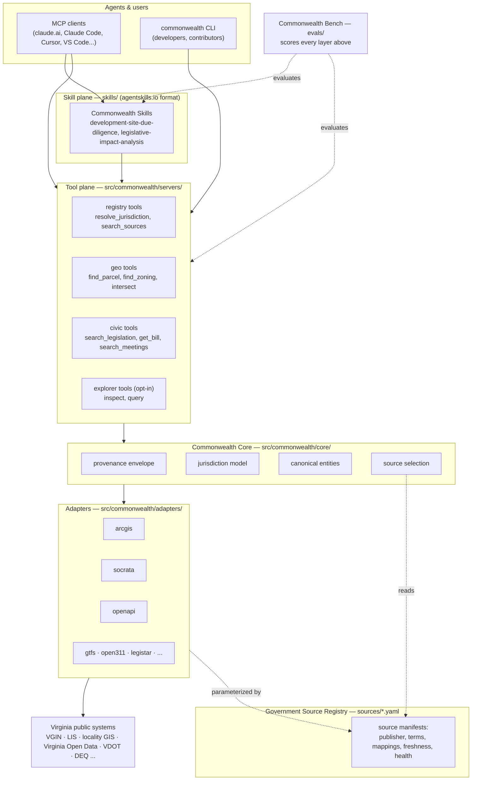
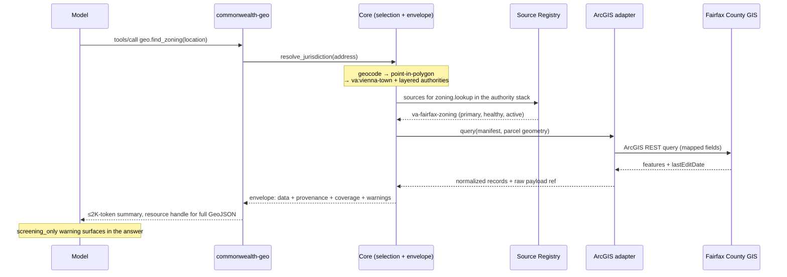
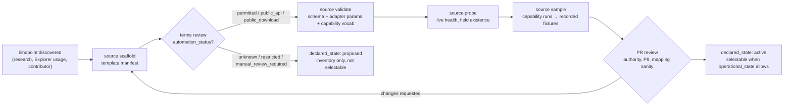
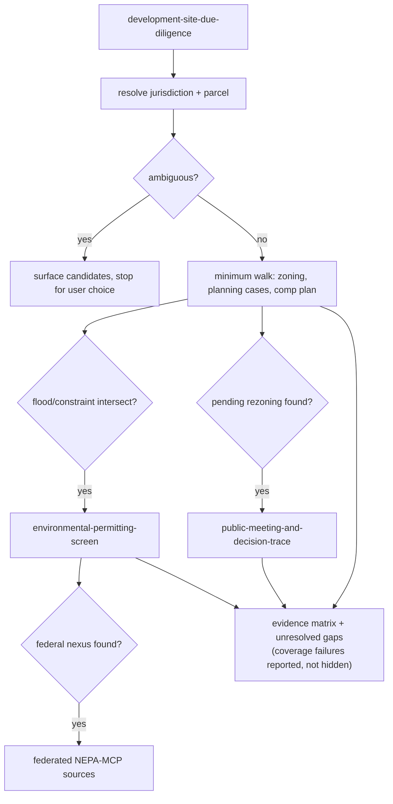
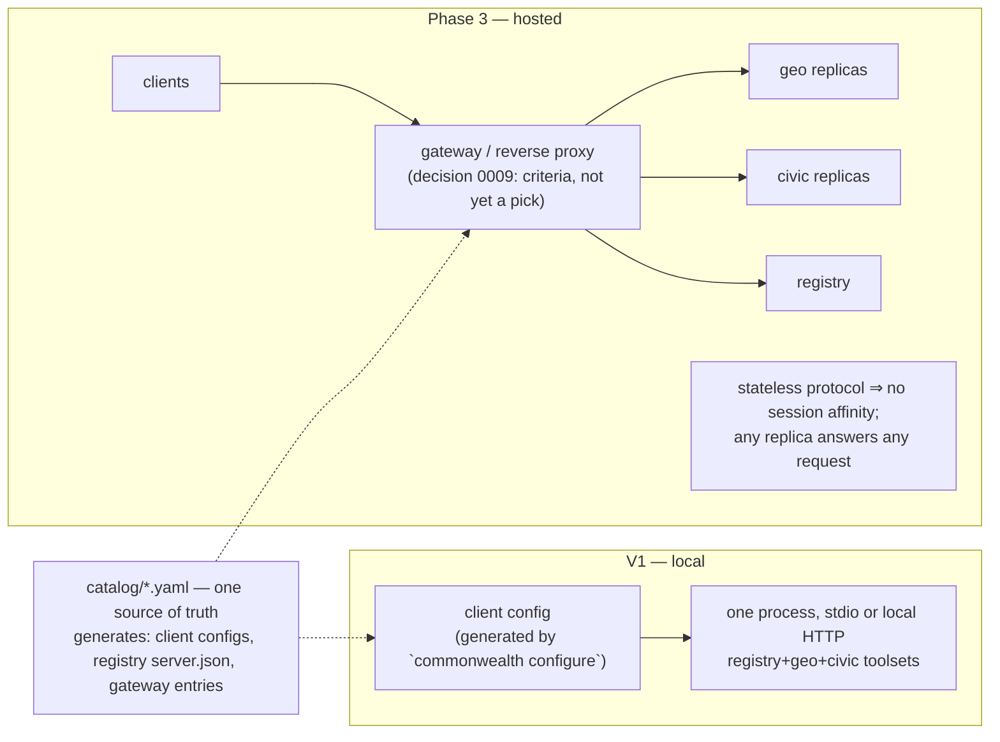

# Architecture and decisions

How Commonwealth-MCP is put together, and why each part is shaped the way
it is.

This file has two halves:

- **Part 1, the system** (§ 1–39) — what exists. The servers, the
  provenance envelope every answer carries, the source registry, the
  adapter layer, and what is planned next.
- **Part 2, the decisions** (0001–0015) — one record per architectural
  choice. Each keeps the options that lost, so you can disagree with a
  choice from what is written here rather than from memory.

They used to be two files. Nearly every question raised by the first half
was answered in the second, so they are one file now.

## Where to look

| You want | Go to |
|---|---|
| How a request travels through the system | § 4, then the diagrams at the end |
| What every tool result contains | § 10 |
| How a government source gets added | § 11 |
| Why there is one server rather than fifteen | Decision 0001 |
| Why two sources that disagree are both shown | Decision 0005 |
| What is built and what is not | § 33, § 39 |

Section numbers (§ 1, § 10.1) and decision numbers (0005) are cited from
code comments and from the specs in this folder. They stay fixed;
renumbering breaks those references.

The evidence behind the decisions is in [research/](../research/README.md).
The per-feature contracts the code is written against are the other files
in this folder, listed in [README.md](../README.md).

**Status:** adopted, being implemented. Fourteen of the fifteen decisions
are settled. 0009, on a hosted gateway, is left open until Phase 3 on
purpose. Two were settled against the recommendation written on them —
0005 and 0015 — and both say so.

**Scope:** Virginia. State agencies, the 133 counties and independent
cities, incorporated towns, regional bodies, school divisions, and other
public entities.

---

# Part 1 — the system

## 1. Executive Summary

Commonwealth-MCP should not be implemented as a collection of one-off MCP servers for every Virginia agency, locality, portal, or API.

The recommended architecture is a **federated domain-MCP ecosystem** with five distinct layers:

1. **Government Source Registry**  
   A declarative, machine-readable inventory of authoritative Virginia public systems, datasets, APIs, GIS services, portals, access requirements, update cadence, provenance, jurisdiction, and adapter mappings.

2. **Adapter and Commonwealth Core Layer**  
   Reusable protocol adapters (ArcGIS REST, Socrata, OGC API, OpenAPI, GTFS, Open311, Municode, Legistar, HTML/CSV/JSON) plus canonical civic data models, jurisdiction resolution, provenance, temporal semantics, pagination, caching, and evidence handling.

3. **Domain MCP Servers**  
   A small number of coherent, independently deployable MCP servers exposing semantic tools such as `geo.find_zoning`, `civic.search_legislation`, and `finance.search_procurements`. These servers should hide platform-specific schemas from agents.

4. **Commonwealth Skills**  
   Agent Skills that encode expert workflows: development-site due diligence, legislative impact analysis, project tracing, locality briefs, procurement scans, environmental permitting screens, and similar multi-source tasks.

5. **MCP Hub / Control Plane + Benchmarks**  
   A catalog/gateway for discovery, deployment, tenancy, credentials, versioning, health, policy, and selective tool exposure; plus an evaluation suite that measures whether agents use the tools correctly.

The recommended design synthesizes the strongest ideas observed across:
- PNNL `nepa-mcp`
- Power-Agent `PowerMCP`, `PowerSkills`, and `PowerAgentBench`
- GSA-TTS `mcp-server-hub-catalog`
- GitHub MCP Server
- Cloudflare domain-specific MCP servers and Code Mode MCP
- AWS MCP / Agent Toolkit patterns
- Context7
- Playwright MCP / CLI+Skills
- Official MCP reference servers

The core architectural principle is:

> **Separate the government source, the protocol adapter, the agent capability, and the expert workflow.**

Example:

```text
Government source:
  Fairfax County zoning ArcGIS layer

Adapter:
  ArcGIS REST

Agent capability:
  geo.find_zoning(location)

Expert workflow:
  development-site-due-diligence
```

Those four objects must evolve independently.

---

## 2. Goals and Non-Goals

### 2.1 Goals

Commonwealth-MCP should:

1. Provide agents with structured access to public Virginia state and local government data.
2. Normalize heterogeneous public systems behind stable semantic capabilities.
3. Preserve authoritative-source provenance and coverage limitations.
4. Support cross-source entity resolution and joins.
5. Scale across Virginia without creating one MCP server per locality.
6. Support both local developer use and centrally hosted multi-user deployment.
7. Make adding a new public source primarily a **configuration + mapping task** whenever possible.
8. Allow domain experts to contribute workflows without writing backend integration code.
9. Keep active tool surfaces small enough for reliable model selection.
10. Support repeatable evaluation of agent behavior and result quality.
11. Make read-only public data the default trust model.
12. Allow later extension to other states without embedding Virginia-specific assumptions into shared adapters and core schemas.

### 2.2 Non-Goals for V1

V1 should not:

- Submit permits, applications, public comments, service requests, bids, or other government transactions.
- Circumvent access controls, CAPTCHAs, rate limits, terms of use, or bulk-access restrictions.
- Treat publicly viewable web pages as automatically permitted for automated scraping.
- Attempt to create a universal ontology for every government record type.
- Guarantee legal conclusions from GIS intersections, dashboard data, or screening results.
- Replace agency determinations, official records, legal research, professional engineering judgment, or formal consultation.
- Build a bespoke MCP server for every Virginia locality or SaaS vendor.
- Depend on browser automation as the primary source ingestion strategy.

---

## 3. Design Principles

### 3.1 Prefer the authoritative source

Prefer authoritative primary sources even if a secondary source is easier to query.

Every tool result should preserve:
- publisher,
- source system,
- dataset/layer,
- source record identifier where available,
- source update date where available,
- retrieval timestamp,
- transformations applied,
- geographic and temporal coverage,
- warnings and partial failures.

### 3.2 Keep domain knowledge out of adapters

Protocol adapters should be generic and unsurprising.

Examples:
- ArcGIS REST client
- Socrata client
- OGC API client
- GTFS reader
- Open311 client
- OpenAPI client

Agent-facing tools should be semantic.

Prefer:

```text
geo.find_zoning(location)
```

over:

```text
arcgis.query_layer(url, layer_id, where, out_fields, geometry, spatial_rel)
```

Keep raw protocol operations as expert escape hatches, not as the default interface.

### 3.3 Progressive Disclosure

Do not expose every possible tool to every agent at once.

Use:
- domain toolsets,
- capability routing,
- skills,
- read-only profiles,
- task-specific activation,
- resources for large results,
- an expert explorer for long-tail sources.

### 3.4 Read-Only by Default

V1 should be overwhelmingly read-only.

For MCP tool annotations where supported:
- `readOnlyHint = true`
- `destructiveHint = false`

But security must not depend on annotations alone.

### 3.5 Return evidence the caller can check

Do not attach arbitrary model confidence numbers to deterministic government data.

Instead return:
- provenance,
- coverage,
- warnings,
- source authority,
- freshness,
- transformation history,
- unresolved ambiguity.

### 3.6 Preserve Raw Source Payloads

Canonical models should normalize cross-source joins, but raw source fields should remain available as evidence or resources.

### 3.7 Human-Reviewable Architecture

Any automated coding agent should surface decisions that change:
- server boundaries,
- authority rules,
- access policy,
- schema semantics,
- source terms,
- write capabilities,
- data retention,
- identity resolution,
- licensing,
- deployment trust.

Those should not be silently inferred.

---

## 4. Architecture Overview

Commonwealth-MCP should be modeled as three planes plus a shared data foundation.

```text
                               AGENT / USER
                                   │
                                   ▼
                       ┌─────────────────────┐
                       │  COMMONWEALTH HUB   │
                       │                     │
                       │ catalog             │
                       │ capability routing  │
                       │ toolset selection   │
                       │ auth / tenancy      │
                       │ versions / health   │
                       │ policy              │
                       └─────────┬───────────┘
                                 │
                ┌────────────────┼────────────────┐
                │                │                │
                ▼                ▼                ▼
          COMMONWEALTH      COMMONWEALTH     EXTERNAL MCPs
              GEO               CIVIC        e.g. NEPA-MCP
                │                │
             tools            tools
                │                │
                └────────┬───────┘
                         ▼
                 COMMONWEALTH CORE
                         │
             canonical civic entities
             provenance / evidence
             jurisdiction identity
             temporal state
             caching / pagination
                         │
          ┌──────────────┼──────────────┐
          ▼              ▼              ▼
       ADAPTERS        ADAPTERS       ADAPTERS
       ArcGIS          Socrata        OGC
       OpenAPI         GTFS           Open311
       Municode        Legistar       HTML/CSV
                         │
                         ▼
            GOVERNMENT SOURCE REGISTRY
                         │
        ┌────────────────┼─────────────────┐
        ▼                ▼                 ▼
      STATE           LOCALITIES         REGIONAL
      VGIN             Fairfax           transit
      VDOT             Loudoun           PDCs
      DEQ              Richmond          utilities
      LIS              ...
```

The **Skill Plane** sits above the domain MCPs:

```text
Commonwealth Skills
├── development-site-due-diligence
├── locality-brief
├── legislative-impact-analysis
├── project-trace
├── procurement-market-scan
├── environmental-permitting-screen
├── infrastructure-access-screen
└── public-meeting-and-decision-trace
```

The **Evaluation Plane** validates the behavior of agents using the system:

```text
Commonwealth Bench
├── source-selection
├── jurisdiction-resolution
├── tool-selection
├── entity-resolution
├── spatial-correctness
├── temporal-correctness
├── provenance
├── coverage-awareness
├── workflow-completeness
└── unsupported-inference
```

---

## 5. Architectural Options Considered

### Option A — Single Monolithic Commonwealth MCP

#### Shape

One MCP server exposes all Commonwealth tools.

```text
commonwealth-mcp
├── registry tools
├── geo tools
├── civic tools
├── finance tools
├── environment tools
├── infrastructure tools
└── people tools
```

#### Advantages

- Simplest client installation.
- Simplest early development.
- One auth and deployment model.
- Easy in-process cross-domain joins.
- Straightforward shared cache.

#### Disadvantages

- Large tool surface.
- Broad dependency graph.
- One failure can affect unrelated domains.
- Harder to isolate credentials.
- Harder to version independent domains.
- Encourages giant abstractions.
- Less suitable for community ownership by domain.

#### Recommended use

Acceptable for an early proof of concept, but **not recommended as the long-run architecture**.

---

### Option B — One MCP Server Per Source / Agency / Locality

#### Shape

```text
mcp-lis
mcp-vdot
mcp-deq
mcp-fairfax
mcp-loudoun
mcp-richmond
...
```

#### Advantages

- Strong source isolation.
- Simple ownership.
- Strong provenance boundaries.
- Easy independent deployment.

#### Disadvantages

- Explodes at Virginia scale.
- Duplicates ArcGIS/Socrata/HTTP logic.
- Pushes cross-source orchestration onto the agent.
- Tool-selection becomes difficult.
- Locality onboarding requires code instead of manifests.
- Creates high operational burden.

#### Recommended use

Only for sources with genuinely unique:
- authentication,
- runtime dependencies,
- stateful workflows,
- legal/terms constraints,
- specialized semantics.

**Do not use this as the default topology.**

---

### Option C — Federated Domain MCPs + Shared Core + Source Registry

#### Shape

```text
commonwealth-registry
commonwealth-geo
commonwealth-civic
commonwealth-finance
commonwealth-infrastructure
commonwealth-environment
commonwealth-people
```

Each domain uses:
- shared adapters,
- shared canonical models,
- declarative source manifests.

#### Advantages

- Good semantic boundaries.
- Tool surfaces remain manageable.
- Independent deployment/versioning.
- Avoids one-server-per-locality proliferation.
- Source onboarding can often be configuration-only.
- Works well with a gateway/catalog.
- Supports cross-source domain joins.
- Aligns with open-source contribution boundaries.

#### Disadvantages

- Requires careful shared-core design.
- Cross-domain workflows must be composed by skills or orchestration.
- Some sources may fit multiple domains.
- Requires governance for canonical entities.

#### Recommendation

**Recommended primary architecture.**

---

### Option D — Code-Mode / Dynamic Explorer First

#### Shape

A few generic tools dynamically inspect source schemas and execute queries.

```text
source.search
source.inspect
source.query
```

#### Advantages

- Very low MCP schema token cost.
- Rapid long-tail source coverage.
- Useful for undocumented/unknown APIs.
- Good for developers and advanced agents.
- Avoids premature modeling.

#### Disadvantages

- More reasoning burden on the agent.
- Lower determinism.
- Harder to evaluate.
- Harder to guarantee source semantics.
- Easier to make unsafe or invalid assumptions.
- Less approachable for end-user civic tasks.

#### Recommendation

Use as **Commonwealth Explorer**, an expert fallback, not as the default user interface.

---

## 6. Recommended Architecture

Adopt **Option C** with selected elements of Options A and D:

1. **Federated domain MCP servers** as the production boundary.
2. **One Hub / catalog UX** so users do not manage many servers manually.
3. **Commonwealth Explorer** for long-tail or not-yet-normalized sources.
4. **Shared Commonwealth Core** for provenance, jurisdiction, canonical entities, and source resolution.
5. **Skills** for multi-source workflows.
6. **Benchmarks** for agent reliability.
7. **Declarative source manifests** instead of locality-specific code wherever possible.

The recommended pattern is:

> PNNL data discipline + Power-Agent layering + GSA-style control plane + GitHub toolsets + Cloudflare-style expert escape hatch.

---

## 7. Server Boundaries

### 7.1 Initial Servers

#### `commonwealth-registry`

Responsibilities:
- resolve jurisdictions,
- search government sources,
- identify authoritative sources,
- inspect source metadata,
- inspect capability coverage,
- report source health/freshness,
- support capability routing.

Suggested tools:

```text
registry.resolve_jurisdiction
registry.search_sources
registry.describe_source
registry.find_authoritative_source
registry.list_capabilities
registry.source_status
```

#### `commonwealth-geo`

Responsibilities:
- parcel lookup,
- boundaries,
- zoning,
- spatial intersection,
- buffers,
- nearby features,
- geospatial source discovery.

Suggested tools:

```text
geo.resolve_location
geo.find_parcel
geo.find_boundaries
geo.find_zoning
geo.find_nearby
geo.intersect
geo.buffer
geo.query_source
```

#### `commonwealth-civic`

Responsibilities:
- legislation,
- state law,
- regulations,
- elections,
- campaign finance,
- public meetings,
- local ordinances.

Suggested tools:

```text
civic.search_legislation
civic.get_bill
civic.get_vote
civic.search_law
civic.search_regulations
civic.search_meetings
civic.get_agenda_item
civic.search_campaign_finance
civic.get_election_results
```

#### `commonwealth-finance`

Responsibilities:
- procurement,
- contracts,
- vendors,
- budgets,
- expenditures,
- awards.

Suggested tools:

```text
finance.search_procurements
finance.get_contract
finance.find_vendor
finance.search_awards
finance.query_expenditures
finance.get_budget
```

#### `commonwealth-infrastructure`

Responsibilities:
- roads,
- transit,
- broadband,
- public infrastructure,
- sites,
- capital projects,
- real-time transportation where permitted.

Suggested tools:

```text
infrastructure.search_projects
infrastructure.get_road_conditions
infrastructure.find_transit
infrastructure.find_sites
infrastructure.find_broadband
infrastructure.find_public_assets
```

#### `commonwealth-environment`

Responsibilities:
- DEQ facilities and permits,
- flood screening,
- natural resources,
- energy resources,
- environmental constraints,
- water-related public data.

Suggested tools:

```text
environment.search_facilities
environment.find_permits
environment.screen_flood
environment.screen_constraints
environment.find_energy_resources
environment.find_water_assets
```

#### `commonwealth-people`

V1 umbrella domain for:
- education,
- workforce,
- public health,
- licenses,
- human services,
- business entities.

Suggested tools:

```text
people.get_school_profile
people.search_professional_license
people.get_labor_market
people.get_health_indicator
people.find_human_services
people.search_business_entity
```

This server may later split into:
- `commonwealth-education`
- `commonwealth-workforce`
- `commonwealth-health`
- `commonwealth-licensing`

only when tool count, dependencies, or ownership justify separation.

---

## 8. Server Promotion Rule

Start with logical toolsets.

Promote a toolset to an independently deployable server when one or more of these are true:

1. Different authentication model.
2. Different trust or access level.
3. Different runtime dependencies.
4. Different scaling characteristics.
5. Different release cadence.
6. Distinct maintainers/ownership.
7. Significant tool count.
8. Significant fault isolation requirement.
9. Data-handling or legal restrictions.
10. Stateful or transactional behavior.

Do **not** split because two tools come from different agencies.

---

## 9. Commonwealth Core

Commonwealth Core is the shared interoperability layer.

It should contain:

```text
commonwealth_core/
├── models/
├── provenance/
├── jurisdiction/
├── temporal/
├── identity/
├── geo/
├── pagination/
├── caching/
├── auth/
├── source_resolution/
├── errors/
└── resources/
```

### 9.1 Canonical Entities

Do not create a universal government ontology.

Start with entities necessary for cross-source joins:

```text
Jurisdiction
Agency
Organization
Location
Parcel
Facility
Project
Permit
PlanningCase
GovernmentAction
LegislativeItem
Procurement
License
InfrastructureAsset
Observation
Evidence
Source
TemporalState
```

#### Example `PlanningCase`

```json
{
  "type": "PlanningCase",
  "id": "fairfax:rz-2026-00123",
  "jurisdiction": {
    "id": "va:fairfax-county",
    "fips": "51059"
  },
  "canonical": {
    "case_number": "RZ-2026-00123",
    "status": "scheduled",
    "applicant": "Example Development LLC",
    "location": {
      "address": "..."
    }
  },
  "source": {
    "source_id": "va-fairfax-planning-cases",
    "publisher": "Fairfax County",
    "record_id": "..."
  },
  "temporal": {
    "retrieved_at": "2026-08-26T...",
    "source_updated_at": "...",
    "effective_at": "..."
  },
  "coverage": {
    "status": "complete",
    "warnings": []
  },
  "raw": {
    "...": "original source fields"
  }
}
```

### 9.2 Canonical IDs

Use stable namespaced IDs.

Examples:

```text
va:fairfax-county
va:richmond-city
va:agency:deq
va:lis:bill:2026:hb1234
va:fairfax:parcel:<local-id>
va:fairfax:planning:<case-id>
```

Do not invent national uniqueness schemes before needed.

### 9.3 Jurisdiction Resolution

Jurisdiction resolution is foundational.

Inputs may include:
- name,
- address,
- coordinates,
- FIPS,
- ZIP,
- parcel,
- locality alias.

Outputs should include:
- canonical jurisdiction ID,
- jurisdiction type,
- FIPS where applicable,
- parent state,
- confidence/ambiguity expressed as resolvable alternatives rather than arbitrary probability where possible.

---

## 10. Provenance and Evidence Contract

Every semantic tool result should follow a common envelope:

```json
{
  "data": {},
  "provenance": [],
  "evidence": [],
  "coverage": {},
  "warnings": [],
  "next_actions": []
}
```

### 10.1 Provenance and Evidence Fields

(Revised 2026-08-26: split into linked source entries and evidence objects so mixed-source results prove which source supports which record — full contract in provenance-envelope.md § 2.)

Source entries, at minimum:

```text
id                    (response-local, e.g. source_01)
publisher
source_id
system
dataset_or_layer
jurisdiction
authority_level
access_path           (live | cache | index)
source_updated_at
retrieved_at
cache_age_seconds
```

Evidence objects, at minimum:

```text
id                    (response-local, e.g. evidence_01)
source_ref
record_id
locator               (stable human-openable URL, omitted when none exists — never guessed)
retrieved_at
effective_at
transformations
payload_hash          (when raw retention permitted)
raw_recovery          (available | forbidden_by_terms | expired)
```

Every material record in `data` carries `evidence_refs`; an unreferenced claim is a contract-test failure.

### 10.2 Coverage Fields

(Revised 2026-08-26: the single `status` enum conflated independent questions; coverage is now dimensions — full table in provenance-envelope.md § 3.)

```text
registry:      covered | partial | none | unknown
execution:     complete | partial | failed
pagination:    complete | truncated | unknown
source_claim:  complete | partial | unknown
result:        hit | empty        (empty is a successful state, not an error)

jurisdictions_searched / jurisdictions_unavailable
time_range
source_failures
known_limitations
```

### 10.3 Execution Provenance

Also capture:

```text
server
server_version
tool
tool_contract_version
adapter
adapter_version
catalog_revision
request_timestamp
```

Data provenance and execution provenance must be distinguishable.

### 10.4 Authority Levels

Suggested values:

```text
primary
official_secondary
official_derived
third_party
unverified
```

Do not equate `primary` with legal dispositiveness.

---

## 11. Government Source Registry

The Government Source Registry is a core open-source asset.

It answers:

> What public system contains this information, who publishes it, how do I access it, how current is it, and how should it map into Commonwealth capabilities?

### 11.1 Example Manifest

```yaml
id: va-fairfax-zoning
name: Fairfax County Zoning
jurisdiction: va:fairfax-county

publisher:
  agency: Fairfax County Department of Planning and Development
  authority_level: primary

domain:
  - geo
  - planning

capabilities:
  - zoning.lookup
  - zoning.spatial_intersection

adapter:
  type: arcgis
  service_url: https://example.gov/arcgis/rest/services/Planning/Zoning/FeatureServer
  layers:
    zoning:
      id: 4
      field_mapping:
        district: ZONING
        object_id: OBJECTID

access:
  mode: anonymous
  authentication: none
  automation_status: permitted
  pii_risk: low

freshness:
  expected_update: daily
  last_verified_at: 2026-08-26T00:00:00Z

authority:
  notes: >
    GIS representation is useful for screening. Confirm controlling adopted
    zoning records when a legal determination is required.

coverage:
  geography: va:fairfax-county
  temporal: current

terms:
  source_terms_url: https://...
  notes: ...

health:
  probe:
    type: arcgis-layer-info
```

### 11.2 Source Manifest Requirements

Every source must include:

- canonical ID,
- publisher,
- jurisdiction,
- domain,
- capabilities,
- adapter,
- access/auth,
- source authority,
- update/freshness,
- coverage,
- terms/automation notes,
- field mappings,
- last verification,
- health probe.

### 11.3 Source Contribution Workflow

A typical locality contribution should be:

```text
1. Add YAML manifest
2. Validate schema
3. Run endpoint health checks
4. Run field-mapping contract tests
5. Run sample semantic tool tests
6. Add fixture
7. Review authority/terms notes
8. Merge
```

Prefer this over writing a new server.

---

## 12. Adapter Layer

Initial adapters:

```text
arcgis
socrata
ogc
openapi
gtfs
open311
municode
legistar
csv_json
html_download
```

Potential later adapters:

```text
civicclerk
boarddocs
opengov
accela
energov
etrakit
powerbi_export
tableau_export
```

### 12.1 Adapter Contract

Every adapter should support a common minimum interface where applicable:

```text
discover()
describe()
query()
paginate()
health()
normalize_errors()
```

Spatial adapters additionally:

```text
query_geometry()
intersect()
buffer_or_delegate()
```

### 12.2 Escape Hatch

Adapters may expose raw calls internally, but domain servers should only expose raw source query tools where needed.

Example:

```text
geo.query_source(source_id, query)
```

This should:
- restrict requests to registered sources,
- validate query structure,
- enforce allowed operations,
- return provenance,
- avoid arbitrary outbound HTTP.

---

## 13. Commonwealth Explorer

Commonwealth Explorer is the long-tail integration path inspired by code-mode patterns.

It should be a separate, opt-in expert capability.

Suggested tools:

```text
explorer.search_sources
explorer.inspect_schema
explorer.query_source
explorer.explain_mapping
```

Potential later tool:

```text
explorer.execute_readonly
```

only if sandboxing and source allowlists are strong.

### 13.1 Purpose

Use Explorer when:
- a source is newly discovered,
- a source is not yet mapped to a semantic tool,
- an agent needs an unusual field,
- contributors are developing a source manifest,
- a source exposes a huge OpenAPI/ArcGIS surface.

### 13.2 Promotion Path

Repeated Explorer usage should inform normalization.

```text
exploratory query
      ↓
useful recurring pattern
      ↓
source mapping
      ↓
semantic capability
      ↓
stable domain tool
      ↓
skill integration
```

---

## 14. MCP Hub / Control Plane

The Hub is conceptually separate from the Government Source Registry.

The Hub answers:

> Which MCP servers are available, how are they deployed, what tools/capabilities do they expose, how are credentials handled, and which server should an agent activate?

### 14.1 Internal MCP Catalog Entry

Do not make an external gateway schema the canonical internal representation.

Use a richer Commonwealth schema and export to:
- GSA/Obot-style catalogs,
- official MCP Registry metadata,
- client configs,
- plugin manifests.

Example:

```yaml
id: commonwealth-geo
display_name: Commonwealth Geo
version: 0.1.0

runtime:
  type: remote
  endpoint: https://mcp.commonwealth.example/geo/mcp
  health: https://mcp.commonwealth.example/geo/health

tenancy:
  mode: shared

access:
  classification: public
  read_only: true

capabilities:
  - id: parcel.lookup
    tool: geo.find_parcel
  - id: zoning.lookup
    tool: geo.find_zoning

toolsets:
  default:
    - geo.resolve_location
    - geo.find_parcel
    - geo.find_zoning
    - geo.find_boundaries
  all:
    - "*"

dependencies:
  source_capabilities:
    - parcel.lookup
    - zoning.lookup

risk:
  level: low
```

### 14.2 Tenancy

Use:

```text
shared
per-user
```

Typical V1 mapping:

#### Shared
- VGIN public services
- VDOT public GIS
- Virginia Open Data
- VEDP public OGC
- Virginia Law
- public local GIS
- static GTFS

#### Per-user
- APIs requiring personal keys
- sources requiring individual authorization
- future restricted systems
- future write capabilities

### 14.3 Runtime

Support:

```text
remote
managed-container
local-stdio
```

Recommended production default:
- Streamable HTTP remote or managed service.

Recommended developer default:
- local stdio or local Streamable HTTP.

---

## 15. Toolset Exposure

The ecosystem may contain more than 100 tools eventually.

The active agent context should contain 8–12 tools per profile, with a hard task-profile ceiling of 20 — the numbers decision 0002 chose.

What `core/toolreg.py` enforces is narrower. This section records the gap. `expand_profile()` raises only above `PROFILE_HARD_CEILING = 20`. `PROFILE_DEFAULT_CEILING = 12` is defined but never read at runtime — `tests/test_repo_health.py` asserts it, so an oversized `default` fails CI, not startup.

The 8-tool floor is enforced nowhere, and `default` expands to five tools today: `registry.resolve_jurisdiction`, `geo.find_parcel`, `geo.find_zoning`, `geo.find_boundaries`, `civic.get_code_section`. That is under 0002's band because the domains that would fill it are unbuilt. Both gaps are logged in the GitHub issues; closing them is either enforcement code or a dated 0002 amendment, and that call is the architect's.

(History: this paragraph said "20–50", was revised 2026-08-26 to "12–25" on the measured accuracy cliffs, and still said "12–25" after 0002 settled on 8–12/20; corrected 2026-08-28. The measurements: selection accuracy falls below 90% at 10–15 tools for small models and 20–30 for mid-tier ones, and Anthropic's own guidance flags degradation past 30–50 — [research part 4](../research/README.md) § 1. 0002 also covers deferred loading / tool search as the growth path.)

Support:
- default toolsets,
- domain toolsets,
- task-specific toolsets,
- read-only toolsets,
- expert/all toolsets.

Example logical profiles:

```text
default
development
civic
geo
environment
finance
infrastructure
all
```

A development task might activate (example corrected 2026-08-28 — the previous one summed to ~28 tools, and a profile that size fails startup under 0002's ceiling; task profiles pick 3–6 tools per domain rather than taking every domain's full default set):

```text
registry: 2 tools
geo: 5 tools
civic: 4 tools
environment: 4 tools
infrastructure: 3 tools
```

Total: 18 tools, inside the ceiling of 20.

---

## 16. MCP Resources

Use MCP resources for large, durable, or reusable context.

Examples:

```text
commonwealth://sources/{source_id}
commonwealth://jurisdictions/{jurisdiction_id}
commonwealth://results/{result_id}
commonwealth://results/{result_id}.geojson
commonwealth://schemas/{entity}
commonwealth://evidence/{evidence_id}
commonwealth://provenance/{record_id}
```

Tools should summarize large results and return resource handles rather than dumping huge payloads into the model context.

Example:

```json
{
  "data": {
    "record_count": 2834,
    "jurisdictions": 4
  },
  "resources": [
    "commonwealth://results/01JXYZ",
    "commonwealth://results/01JXYZ.geojson"
  ]
}
```

---

## 17. Skills Architecture

Skills encode professional workflows, not source manuals.

Avoid skills named:
- `vdot`
- `deq`
- `fairfax`
- `lis`

Prefer outcome-oriented skills.

### 17.1 Initial Skills

#### `development-site-due-diligence`

Workflow:

1. Establish project geometry.
2. Resolve jurisdiction.
3. Identify parcels.
4. Retrieve zoning.
5. Retrieve comp-plan/planning context where available.
6. Retrieve pending and approved planning cases.
7. Trace public meetings and formal actions.
8. Screen environmental and flood constraints.
9. Identify transportation, broadband, and other infrastructure.
10. Search relevant state regulatory actions.
11. Classify project stage:
   - rumor/unverified,
   - announced,
   - application filed,
   - permit pending,
   - approved,
   - construction,
   - operational.
12. Produce evidence matrix and unresolved gaps.

#### `legislative-impact-analysis`

1. Resolve bill and version.
2. Determine current status.
3. Retrieve amendments.
4. Retrieve votes.
5. Retrieve fiscal impacts.
6. Resolve Code sections affected.
7. Retrieve current Code text.
8. Search related regulations.
9. Identify responsible agencies.
10. Identify locality implications.
11. Distinguish enacted law from proposed language.

#### `locality-brief`

1. Resolve locality.
2. Basic demographics/economy.
3. Budget and expenditures.
4. Procurements.
5. Capital projects.
6. Planning/development.
7. Transportation.
8. Schools.
9. Elections/governance.
10. Environmental constraints.
11. Recent major public meetings/actions.

#### `project-trace`

Given a company/project/site:
1. Resolve organizations and aliases.
2. Resolve parcel/location.
3. Match planning records.
4. Match DEQ/environmental permits.
5. Match public meetings.
6. Match procurement/incentives where available.
7. Match transportation/infrastructure.
8. Match state/local regulatory records.
9. Construct chronology.
10. Report ambiguous matches separately.

#### `procurement-market-scan`

1. Define procurement concept and aliases.
2. Search state solicitations.
3. Search awards.
4. Search expenditure data.
5. Search configured local systems.
6. Normalize vendor identities.
7. Distinguish solicitation, award, contract, and payment.
8. Report gaps due to portal coverage.

#### `environmental-permitting-screen`

1. Establish ROI.
2. Identify relevant Virginia environmental sources.
3. Query permits/facilities.
4. Query flood/resource constraints.
5. Invoke federal NEPA-MCP sources where appropriate.
6. Distinguish screening results from agency determinations.
7. Report failed/partial sources.

#### `public-meeting-and-decision-trace`

1. Resolve governing body.
2. Search agenda systems.
3. Retrieve agenda items.
4. Retrieve attachments/packets where permitted.
5. Retrieve votes/minutes.
6. Link planning cases or projects.
7. Distinguish discussion from formal action.
8. Produce chronology with citations/evidence.

---

## 18. Skill Escalation Logic

Every workflow skill should include explicit escalation triggers.

Example:

| Finding | Escalate |
|---|---|
| Parcel intersects floodway | flood-risk workflow |
| Rezoning is pending | planning-case trace |
| State environmental permit found | permitting trace |
| Federal funding/action identified | NEPA/federal compliance workflow |
| SCC docket references utility upgrade | utility-regulatory workflow |
| Historic resource near ROI | cultural-resource screen |
| Source coverage partial | source-verification workflow |
| Conflicting parcel identifiers | identity-resolution workflow |

Escalation should be driven by findings, not by calling every available tool.

---

## 19. Authentication and Security

### 19.1 V1 Posture

Target:

```text
public
shared
read-only
low-risk
```

### 19.2 Access Classes

```text
public
authenticated-public
restricted
```

### 19.3 Credential Modes

```text
none
service-shared
per-user-api-key
oauth
other-user-auth
```

Note added 2026-08-26: anonymous public access is a feature to preserve as long as possible (auth friction is the ecosystem's #1 remote-server complaint). When authenticated tiers arrive (Gate D), target Enterprise-Managed Authorization (EMA/ID-JAG, a stable MCP extension) for institutional users and Client ID Metadata Documents for client registration — Dynamic Client Registration is deprecated at the protocol level. See [research part 1](../research/README.md) § 1, § 7 and [research part 4](../research/README.md) § 5.

### 19.4 Write Separation

If future transaction tools are added:

```text
Commonwealth Public Data MCP
```

must remain logically and ideally operationally separate from:

```text
Commonwealth Actions MCP
```

Examples of future actions:
- submit service request,
- submit public comment,
- file application,
- update a case,
- schedule inspection.

Those require:
- user identity,
- explicit authorization,
- audit trail,
- idempotency,
- human confirmation policy,
- stronger threat model.

---

## 20. Legal, Terms, and Automation Policy

Every source manifest must include an automation status:

```text
permitted
public_api
public_download
manual_review_required
restricted
do_not_automate
unknown
```

Rules:

1. Public visibility alone does not imply automation permission.
2. Where an official API exists, prefer it.
3. Where bulk downloads exist, prefer them over scraping.
4. Do not bypass anti-bot mechanisms.
5. Do not treat restricted court/CAD/land-record systems as ordinary open data.
6. Store terms notes with the source.
7. Require human architect review before enabling questionable automation.

---

## 21. Caching and Freshness

### 21.1 Cache by Source Semantics

Examples:

- static GIS metadata: hours/days
- current legislative status: minutes
- traffic: seconds/minutes
- election results on election night: short TTL
- historical budget data: long TTL

### 21.2 Freshness Metadata

Every result should distinguish:
- source effective/update time,
- retrieval time,
- cache age.

### 21.3 Cache Invalidation

Use:
- TTL,
- ETag/Last-Modified where available,
- source-specific update schedule,
- manual invalidation,
- versioned source manifests.

### 21.4 Protocol-Native Cache Hints (added 2026-08-26; corrected same day)

The 2026-07-28 spec requires `ttlMs` and `cacheScope` on **list/read results** (`tools/list`, `resources/read`, and peers via `CacheableResult`) — **not on ordinary `tools/call` results** (correction per the 2026-08-26 architecture review § 2.3; the changelog's own list confirms it). Consequences: source freshness on tool results remains the Commonwealth envelope's job (`retrieved_at`, `cache_age_seconds`, `source_updated_at`); protocol cache hints apply where they exist — result *resources* served via `resources/read` declare `ttlMs` from manifest `ttl_hint_seconds` and `cacheScope: "public"` for the public surface, and tool listings declare long TTLs. ETags for tool results are on the protocol roadmap; adopt when shipped. See [research part 1](../research/README.md) § 1.

---

## 22. Error Model

Normalize errors into typed categories (revised 2026-08-26 with the dimensional coverage model — provenance-envelope.md § 3):

```text
SourceUnavailable
AuthenticationRequired
AuthorizationDenied
RateLimited
SourceSchemaChanged
InvalidQuery
AmbiguousEntity
UnsupportedJurisdiction
TermsRestricted
```

`NoResults`, `NoCoverage`, and `PartialResults` are no longer errors: an empty match is `coverage.result: "empty"`, a registry gap is `coverage.registry: "none"`, and a partial run is `coverage.execution: "partial"` — all successful responses whose coverage dimensions carry the distinction. Errors are reserved for conditions that prevent a valid answer.

The original rule survives in stronger form: an empty result, a registry gap, and a source outage must never read the same, and the coverage dimensions make collapsing them a schema violation rather than a discipline. That distinction is critical for government research.

---

## 23. Observability

For every tool call record:

```text
request_id
server
server_version
tool
tool_contract_version
source_ids
adapter
latency
cache_status
records_returned
pagination_status
partial_failures
auth_mode
timestamp
```

Do not log:
- secrets,
- unnecessary personal data,
- restricted raw records.

Adopt OpenTelemetry conventions rather than a bespoke logging story: the 2026-07-28 spec documents OTel trace-context propagation in `_meta` (`traceparent`/`tracestate`), protocol-level logging is deprecated, and the surveyed production servers (grafana, osmmcp, ContextForge) all standardized on OTel. (Added 2026-08-26.)

Metrics should include:
- tool success rate,
- source health,
- schema-change failures,
- rate limits,
- partial result rate,
- average records,
- agent tool-selection patterns in evals.

---

## 24. Repository Strategy

### 24.1 Recommended Initial Repositories

#### Repository 1 — `commonwealth-mcp`

Contains:
- servers,
- core models,
- adapters,
- source registry,
- initial skills,
- tests,
- evals.

Suggested shape:

```text
commonwealth-mcp/
├── pyproject.toml
├── README.md
├── SECURITY.md
├── CONTRIBUTING.md
│
├── src/commonwealth/
│   ├── cli/
│   ├── core/
│   │   ├── models/
│   │   ├── provenance/
│   │   ├── jurisdiction/
│   │   ├── temporal/
│   │   ├── identity/
│   │   └── errors/
│   ├── adapters/
│   │   ├── arcgis/
│   │   ├── socrata/
│   │   ├── ogc/
│   │   ├── openapi/
│   │   ├── gtfs/
│   │   ├── open311/
│   │   ├── municode/
│   │   └── legistar/
│   ├── servers/
│   │   ├── registry/
│   │   ├── geo/
│   │   ├── civic/
│   │   ├── finance/
│   │   ├── infrastructure/
│   │   ├── environment/
│   │   └── people/
│   └── explorer/
│
├── sources/
│   ├── state/
│   ├── local/
│   └── regional/
│
├── skills/
│   ├── development-site-due-diligence/
│   ├── locality-brief/
│   ├── legislative-impact-analysis/
│   ├── project-trace/
│   └── procurement-market-scan/
│
├── tests/
│   ├── unit/
│   ├── adapters/
│   ├── contracts/
│   ├── sources/
│   └── tools/
│
└── evals/
    ├── tasks/
    ├── fixtures/
    ├── scorers/
    └── baselines/
```

#### Repository 2 — `commonwealth-mcp-catalog`

Contains:
- MCP deployment catalog,
- gateway manifests,
- runtime metadata,
- tenancy,
- credential declarations,
- health checks,
- version pinning,
- exported GSA/Obot-compatible entries if desired.

Suggested shape:

```text
commonwealth-mcp-catalog/
├── README.md
├── schema/
│   └── catalog.schema.json
├── servers/
│   ├── commonwealth-registry.yaml
│   ├── commonwealth-geo.yaml
│   ├── commonwealth-civic.yaml
│   ├── commonwealth-finance.yaml
│   └── commonwealth-environment.yaml
├── external/
│   └── pnnl-nepa-mcp.yaml
├── policies/
│   ├── public-readonly.yaml
│   └── authenticated.yaml
└── tests/
```

### 24.2 Later Repository Split

When the contributor ecosystem grows:

```text
CommonwealthSkills
CommonwealthBench
CommonwealthRegistry
```

may become separate repositories.

Do not split them prematurely.

---

## 25. CLI

Provide a strong CLI.

Suggested commands:

```bash
pipx install commonwealth-mcp

commonwealth install
commonwealth doctor

commonwealth serve
commonwealth serve --servers registry,geo,civic

commonwealth tools list
commonwealth tools list --server geo

commonwealth sources search zoning
commonwealth sources inspect va-fairfax-zoning
commonwealth sources validate sources/local/fairfax/zoning.yaml
commonwealth sources verify va-fairfax-zoning

commonwealth catalog list
commonwealth catalog inspect commonwealth-geo
commonwealth catalog health

commonwealth configure claude
commonwealth configure codex
commonwealth configure vscode
```

Contributor commands:

```bash
commonwealth source scaffold arcgis
commonwealth source validate <manifest>
commonwealth source test <manifest>
commonwealth eval run development-site
```

---

## 26. Packaging and Transport

### 26.1 Python

Recommended initial implementation:
- Python 3.12+
- Server framework per decision 0003 — "FastMCP" now names two different things (the official SDK v2 renamed its bundled class to `MCPServer`; standalone FastMCP is at 3.4.7/4.0-beta), so the choice is a recorded decision, pinned exactly, never the bare word.
- Pydantic 2
- httpx
- shapely / pyproj only where needed
- uv for development
- pipx/uvx for installation

This aligns with the strongest observed government-data implementation patterns and minimizes contributor friction. (PNNL's nepa-mcp, the closest domain analog, runs Python 3.12 + standalone FastMCP 3.4.x as of 2026-08.)

### 26.2 Transports

Support:
- stdio for local developer clients,
- Streamable HTTP for hosted deployment.

Do not build new functionality around deprecated SSE patterns.

Design constraint added 2026-08-26: the 2026-07-28 protocol revision made MCP stateless (no sessions, no initialize handshake; `server/discover`; per-request `_meta`). Build servers stateless from the start — cross-call state is explicit server-minted handles (result resources, cursors) passed as tool arguments, and any replica can answer any request. See [research part 1](../research/README.md) § 1.

### 26.3 Containerization

Every hosted server should:
- expose `/mcp`,
- expose `/health`,
- have pinned image versions,
- run non-root where practical,
- support configuration through environment/secrets,
- avoid embedding credentials.

---

## 27. Tool Contract Guidelines

Every semantic tool should have:

1. Short action-oriented name.
2. Clear description of when to use it.
3. Small number of meaningful parameters.
4. Stable typed response.
5. Provenance.
6. Coverage.
7. Warnings.
8. Pagination semantics.
9. Resource handles for large payloads.
10. Explicit ambiguity behavior.

Avoid parameters that merely mirror vendor APIs.

Bad:

```text
where
outFields
spatialRel
returnGeometry
f
```

Better:

```text
location
jurisdiction
date_range
status
include_geometry
```

---

## 28. Source Selection Algorithm

Semantic tools should not hard-code one source when multiple jurisdictions are possible.

High-level algorithm:

```text
1. Resolve jurisdiction
2. Resolve requested capability
3. Query Source Registry
4. Rank sources:
   a. jurisdiction match
   b. capability match
   c. authority
   d. health
   e. coverage
   f. freshness
5. Select primary source
6. Optionally query secondary official source for reconciliation
7. Normalize
8. Return provenance + coverage
```

Do not silently reconcile conflicting official records. Return the conflict.

---

## 29. Entity Resolution

Entity resolution is a strategic capability.

V1 should support:
- organization names/aliases,
- project names,
- parcel IDs,
- case numbers,
- vendor names,
- bill IDs,
- permit IDs.

Keep matches explicit:

```json
{
  "entity": "...",
  "matches": [
    {
      "source_id": "...",
      "record_id": "...",
      "match_basis": [
        "exact_case_number",
        "same_parcel"
      ]
    }
  ],
  "ambiguities": []
}
```

Avoid opaque probabilistic linking where deterministic identifiers exist.

---

## 30. Cross-Source Chronology

A major differentiator should be a reusable event model.

Canonical `GovernmentAction` / `Observation` should allow chronology such as:

```text
2025-03-14 planning application filed
2025-05-02 staff report issued
2025-06-20 planning commission hearing
2025-07-15 board approval
2025-08-03 DEQ permit issued
2026-01-10 construction activity observed
```

Every event needs:
- source,
- date type,
- subject/entity,
- action type,
- status,
- evidence.

---

## 31. Tool and Skill Evaluation

### 31.1 Commonwealth Bench

Create benchmark tasks from real Virginia questions.

Score:

| Dimension | Example |
|---|---|
| Source selection | Did the agent pick the authoritative locality source? |
| Jurisdiction | Did it distinguish Fairfax County from Fairfax City? |
| Tool selection | Did it use zoning rather than generic web search? |
| Argument correctness | Correct parcel/location/date range? |
| Entity resolution | Correct project/vendor/company? |
| Spatial correctness | Correct containment/intersection? |
| Temporal correctness | Correct “as of” date/status? |
| Provenance | Does every material finding tie to evidence? |
| Coverage awareness | Did it distinguish no-hit from failed source? |
| Workflow completeness | Did it follow required steps? |
| Unsupported inference | Did it overstate legal/causal conclusions? |
| Efficiency | Did it avoid unnecessary calls? |

### 31.2 Public / Hidden Eval Split

Adopt a PowerAgentBench-like structure:

```text
public:
  task
  allowed tools
  visible source data
  expected output schema

hidden:
  authoritative answer checks
  withheld edge cases
  source-failure simulations
  ambiguity cases
  coverage traps
```

---

## 32. Initial Evaluation Tasks

Examples:

1. Identify the current zoning for a known Fairfax parcel.
2. Find every vote on a selected LIS bill.
3. Trace a rezoning from filing through final action.
4. Find Virginia procurement awards to a known vendor over a date range.
5. Determine whether a site intersects mapped flood hazard.
6. Compare state and locality sources for the same project.
7. Identify a locality with no registered source and correctly return `coverage.registry: none` (the registry-gap trap), distinct from an outage's `execution: partial`.
8. Distinguish Fairfax City from Fairfax County.
9. Resolve a company alias across eVA and local planning data.
10. Use Explorer for a source not yet normalized, then produce a candidate source manifest.

---

## 33. Implementation Phases

### Phase 0 — Architecture Spike

Deliver:
- core package skeleton,
- one source manifest schema,
- one MCP catalog schema,
- one ArcGIS adapter,
- one Socrata adapter,
- provenance envelope,
- jurisdiction model,
- basic CLI,
- 5 benchmark tasks.

Use:
- VGIN,
- Virginia Open Data,
- one locality,
- one LIS endpoint.

Goal:
Validate boundaries before building breadth.

### Phase 1 — Useful Virginia Core (re-sequenced 2026-08-26 into two milestones)

The 2026-08-26 architecture review's verdict was adopted: the original Phase 1 attempted two domains, three adapters, many sources, and two flagship skills at once — many partial systems, no single convincing path. Phase 1 now proves one complete vertical, then repeats it.

**Milestone 1a — the geo vertical** (the revised plan in Part 2 review round 2 § 6 is the adopted sequence):
- registry + geo packages in one process,
- government source registry with terms/classification review flow,
- source health probes (runtime state, not manifest PRs),
- sources: VGIN, Fairfax County, Richmond City, one rural county, one incorporated town,
- skill: `parcel-zoning-screen`,
- capability routing + profiles, CLI (`doctor`, `tools call`, source workflow, `configure --profile`),
- Tier-1 contract tests and Tier-2 tool-selection evals.

**Milestone 1b — the civic vertical** (starts after 1a's beta exit):
- civic package (LIS, Virginia Law),
- `legislative-impact-analysis`,
- Virginia Open Data (socrata adapter),
- VDOT/DEQ/VDH as practical.

Goal:
One proven manifest→adapter→capability→envelope→surfaces→eval path, then breadth on that rail. Cross-source questions arrive with 1b.

### Phase 2 — Coverage Expansion

Add:
- finance,
- infrastructure,
- environment,
- more locality manifests,
- GTFS,
- OGC,
- Open311,
- Municode,
- public meeting platforms.

Goal:
Increase source coverage primarily through adapters/manifests.

### Phase 3 — Commonwealth Hub

Add:
- hosted MCP gateway/catalog,
- toolset activation,
- tenancy,
- credentials,
- versioning,
- health,
- external MCP federation.

Goal:
Make multi-user deployment straightforward.

### Phase 4 — Explorer and Contribution Flywheel

Add:
- long-tail source explorer,
- source scaffold CLI,
- automated manifest discovery candidates,
- contributor documentation,
- source-quality dashboard.

Goal:
Scale source onboarding.

### Phase 5 — Advanced Identity / Writes

Only after explicit architecture review:
- OAuth,
- authenticated portals,
- write/action MCPs,
- stronger audit,
- human confirmation,
- policy engine.

---

## 37. Human Architecture Review Gates

Require human review before:

#### Gate A — Canonical Model Freeze
Before declaring V1 entity schemas stable.

#### Gate B — New Automation Class
Before adding browser scraping or unofficial endpoints.

#### Gate C — Hosted Gateway
Before centralized multi-user deployment.

#### Gate D — Authenticated Sources
Before per-user credentials.

#### Gate E — Persistent Historical Store
Before retaining government datasets beyond cache TTLs.

#### Gate F — Write Capability
Before any transaction against government systems.

#### Gate G — Cross-State Generalization
Before abstracting Virginia-specific concepts into national schema.

---

## 38. Acceptance Criteria for V1

V1 is successful when:

1. A developer can install and configure Commonwealth in under 10 minutes.
2. `commonwealth doctor` verifies installed servers and source health.
3. A new ArcGIS-based locality source can be added without modifying server code.
4. At least three representative localities work through the same Geo MCP.
5. Semantic tools return standardized provenance and coverage.
6. An agent can complete `parcel-zoning-screen` with benchmarked reliability (revised 2026-08-26; the two flagship workflows become acceptance criteria for their own milestones, 1b and beyond).
7. Failed sources do not become false “no result” answers.
8. Tool surfaces remain task-appropriate rather than exposing every endpoint.
9. Raw source evidence remains recoverable.
10. No write capability exists.
11. No restricted or questionable source is automated without explicit approval.
12. Benchmark results are reproducible across at least two model/client configurations.

Measured additions (2026-08-26 review § 7), tracked from the first milestone:

13. Median time to add an ArcGIS source, and the percentage of source additions needing no server-code change.
14. Coverage-dimension accuracy on hidden traps, and claim-to-evidence completeness (every material record resolves its evidence refs).
15. Tool-selection accuracy by model and profile (Tier-2 evals).
16. Warm healthy-source latency, and a partial-response deadline during a simulated upstream outage.
17. Install success by supported OS and Python version; number of outside developers completing the quickstart without maintainer help.

Performance budgets start as hypotheses, are measured during the contract spike, then freeze: `data` at or under ~2,000 tokens; one retry inside the total request deadline; bounded concurrency per government host; stale-if-error served only when the envelope says it is stale; no probe above its reviewed politeness cadence.

---

## 39. Delivery Sequence

Superseded 2026-08-26 by the revised plan in Part 2 review round 2 § 6, adopted as the working sequence. (Retitled from "Suggested First 90 Days" with its week-numbered stage labels dropped, 2026-08-28: development here is not paced in calendar weeks; the ordering and the exit criteria are the content.) Its shape, for this document's record:

### Stage 1 — contract spike
Blocking decisions chosen; official-SDK server path proven; one ArcGIS source registered; envelope wire schema + coverage dimensions defined; exact jurisdiction lookup; egress policy; Tier-1 contract tests. Exit: one address/parcel query returns valid evidence and honest coverage.

### Stage 2 — geo vertical
Registry + geo packages in one process; `geo.find_parcel` and `geo.find_zoning`; Fairfax County, Richmond City, one rural county, one nested town; recorded fixtures; `doctor`, direct tool calls, source validation, profile activation. Exit: a new ArcGIS locality lands through a manifest with no server-code change.

### Stage 3 — developer product
Source-authoring and capability-extension contracts published; idempotent `configure` with `--dry-run`; terms and sensitive-data review flow complete; Tier-2 tool-selection evals; ship `parcel-zoning-screen`. Exit: an outside developer adds a source and builds a working tool without maintainer help.

### Stage 4 — hardening and beta
Result-resource storage (per decision 0013); runtime health overlay; injection and source-failure fixtures; privacy and logging rules enforced; four representative MCP clients tested; benchmark baseline, limits, and coverage published; public beta.

The civic/LIS vertical (milestone 1b) starts after this exit. Hub, Explorer, finance, infrastructure, environment, authenticated sources, and writes all stay out of the first milestone.

---


---

# Part 2 — the decisions

One record per architectural choice. Each has the context, every option
that was seriously considered with its arguments, a recommendation, and
the choice that was actually made.

**The losing options stay on the page.** Six months from now, the useful question is not what was chosen but what
was given up, and whether the reason still holds.

Two of the fifteen were decided against the recommendation written on
them, 0005 and 0015. Both keep the rejected recommendation intact.

| # | Decision | Status |
|---|---|---|
| [0001](#0001--v1-server-topology) | V1 server topology | Chosen 2026-08-26 |
| [0002](#0002--active-toolset-sizing-and-exposure) | Active toolset sizing and exposure | Chosen 2026-08-26 |
| [0003](#0003--python-server-framework) | Python server framework | Chosen 2026-08-26 |
| [0004](#0004--ambiguity-interaction-pattern) | Ambiguity interaction pattern | Chosen 2026-08-26 |
| [0005](#0005--source-authority-rules) | Source authority rules | Chosen 2026-08-26, against the recommendation |
| [0006](#0006--data-retention) | Data retention | Chosen 2026-08-26 |
| [0007](#0007--repository-layout) | Repository layout | Chosen 2026-08-26 |
| [0008](#0008--explorer-execution-model) | Explorer execution model | Chosen 2026-08-26 |
| [0009](#0009--hosted-gateway--criteria-not-a-pick) | Hosted gateway | Open, deferred to Phase 3 |
| [0010](#0010--entity-resolution--deterministic-only-or-probabilistic-too) | Entity resolution | Chosen 2026-08-26 |
| [0011](#0011--license-strategy) | License strategy | Chosen 2026-08-26 |
| [0012](#0012--canonical-schema-scope-for-v1) | Canonical schema scope for V1 | Chosen 2026-08-26, freezes at Gate A |
| [0013](#0013--result-handles-and-cache-backend) | Result handles and cache backend | Chosen 2026-08-26 |
| [0014](#0014--egress-policy-and-data-classification) | Egress policy and data classification | Chosen 2026-08-26 |
| [0015](#0015--developer-surfaces) | Developer surfaces | Chosen 2026-08-26, against the recommendation |

The set that had to be settled before the contract spike could start was
0001–0005, 0012, 0013, 0014, and 0015. All are settled.

To propose a new record, or to argue that a settled one should reopen, see
[CONTRIBUTING.md](../CONTRIBUTING.md).

---

## 0001 — V1 Server Topology

**Status:** Chosen 2026-08-26. One MCP server/process, domain code packages. Reviewer concurred.
**Context:** § 5 settled the long-run shape (federated domain servers, Option C). This record is about V1 only: how many *processes* exist on day one, and what a "server" is to a first user. The 2026-07-28 stateless protocol ([research part 1](../research/README.md) § 1) changes the calculus: with no sessions and no handshake, running several logical servers behind one process or one endpoint is mechanically simpler than it was.

---

### Option A: One process, three logical servers as toolsets

One `commonwealth serve` process exposing registry/geo/civic tools, partitioned by toolsets and tool-name prefixes. Domain boundaries exist in the code (separate packages, separate tool registries) but not in deployment.

- For: one install, one endpoint, one health check; cross-domain calls are in-process; the ten-minute-install criterion is easiest here; matches how GitHub's server handles a much larger surface (toolsets, not processes); toolsets already give task-size surfaces to clients.
- Against: fault isolation is nil (a geo dependency crash takes civic down); dependency graph unions (shapely/pyproj land in everyone's install); release cadence is coupled; the "federated" story exists only in code review, and drift toward a monolith is a standing temptation the promotion rule (§ 8) must actively resist.
- Evidence: community tool-count findings don't force process separation, only *surface* separation; heavyweight geo deps are real (pyproj wheels ~10-20MB, fine for one package). Statelessness removes the shared-session argument for co-location entirely.

### Option B: Three processes from day one (registry, geo, civic)

Independent `commonwealth-registry`, `commonwealth-geo`, `commonwealth-civic` processes; a client config lists three servers.

- For: honest federation from the start; per-domain dependency sets; fault and release isolation; matches the long-run production story so Phase 3 doesn't re-platform.
- Against: triple the install/config friction exactly when adoption is most fragile; three processes to health-check with no Hub yet; cross-domain joins (geo asking registry for source resolution) become network calls or shared-library calls anyway; V1's actual users (a handful) get zero benefit from the isolation.
- Evidence: GSA's catalog world assumes independent servers *with a gateway above them*; without the gateway, multi-server UX is the friction the community complains about ([research part 4](../research/README.md) § 5-6).

### Option C: One process, but registry is a library, not a server

Geo and civic are the only tool surfaces; source resolution happens inside them via the registry as a shared library, with registry *tools* (search/describe sources) deferred until Explorer needs them.

- For: smallest possible tool surface for the core use cases; no "meta" tools competing for the model's attention against data tools (a real selection hazard: agents call registry.search_sources when they should call geo.find_zoning).
- Against: loses the discovery UX that makes the system explainable ("what sources does this cover?" is a question users ask on day one); Explorer and the contribution flywheel need registry tools soon anyway; hiding the registry makes coverage debt invisible to exactly the audience that could contribute.

### Recommendation

**A, with B's boundaries enforced in code**: one process for V1, three packages with no cross-imports except through Commonwealth Core, separate tool registries, toolset-per-domain, and the § 8 promotion rule applied at Phase 2/3 when hosting begins (geo is the likely first split: heaviest deps, spatial scaling). Registry tools ship but stay out of the `default` toolset (C's insight, kept): they live in a `discovery` toolset activated on demand.

**What would change this:** a Phase 1 contributor wanting to run only civic; a geo dependency conflict in practice; hosting earlier than planned. Any of those flips to B for the affected domain; the code boundaries make that a packaging change, not a rewrite. Bench toolset-size runs (bench.md § 5) showing meta-tool confusion would push registry tools further out of default profiles.

**Review round 2 (2026-08-26, external review):** concurs with A, with a framing correction adopted here: describe it as *one MCP server/process with three code packages*, not "three logical servers" — the client sees one server; the federation is an internal discipline until promotion actually happens. The narrowed plan (geo vertical first) makes this smaller still: V1 runs registry+geo packages, civic joins at the next milestone.

### Choice (2026-08-26)

**A, with B's boundaries enforced in code**, as recommended: one process, three packages (registry/geo/civic) with no cross-imports except through Commonwealth Core, separate tool registries, toolset-per-domain. Registry tools ship in a `discovery` toolset, not `default`. No change from the recommendation on file.

---

## 0002 — Active Toolset Sizing and Exposure

**Status:** Chosen 2026-08-26. 8-12 tool defaults, task ceiling 20 until local evals justify more.
**Context:** § 15 budgeted 20-50 active tools. Field measurements since say that is the upper half of the danger zone: accuracy cliffs below 90% at 10-15 tools for small models and 20-30 for mid-tier ones; Anthropic's own guidance flags degradation past 30-50 and ships tool search with >85% context savings as the mitigation ([research part 4](../research/README.md) § 1, [research part 1](../research/README.md) § 4). The number is a product decision, not a footnote: it decides how many domains a "development due diligence" profile can span.

---

### Option A: Small fixed profiles (12-20 tools), more profiles

Default profiles stay under ~20 tools; cross-domain tasks get purpose-built profiles (development, procurement-scan) that cherry-pick 3-6 tools per domain rather than unioning domain defaults.

- For: inside the measured comfort zone for every model tier; profiles double as documentation of what a task needs; per-profile bench scores are meaningful.
- Against: profile proliferation is its own maintenance surface; a task that outgrows its profile mid-conversation hits a wall the user must notice ("switch to the spatial profile"); cherry-picking is a judgment that will sometimes be wrong.

### Option B: Design-spec status quo (20-50), rely on strong models

Keep generous defaults, accept that small models degrade, document "use a frontier model."

- For: fewer profiles to maintain; frontier models do hold 30-50 tools; simplest mental model.
- Against: contradicts the measured cliffs for everyone else; "works on Opus" is a bad pitch for a public-goods project whose university users run cheap models; the token dead-weight is paid even when accuracy holds.

### Option C: Lean on client-side tool search / deferred loading

Expose everything; mark all but a core set defer-loaded; let clients that support tool search pull what they need.

- For: aligns with where the protocol is going (server-side progressive discovery is on the roadmap); no profile curation; scales to the eventual 100+ tool ecosystem.
- Against: tool search support is uneven across clients today, and Commonwealth's audience skews toward hosted clients whose behavior we don't control; punts the curation problem to a ranking function nobody has tuned for civic queries; harder to bench ("which tools were even visible?" becomes a variable).

### Recommendation

**A now, C as it matures**: defaults of **8-12 tools per profile, task-profile ceiling of 20** until local Tier-2 evals justify more (tightened 2026-08-26 from 12-20/25 on review round 2 — the measured cliffs for small models sit at 10-15, and the burden of proof belongs on adding tools, not removing them). Cross-domain task profiles are curated by the skills (a skill's minimum data walk *is* the profile definition; generate profiles from skill metadata so the two never drift). Publish per-profile, per-model bench numbers (bench.md § 1 Tier 2) so the sizing argument stays empirical. Adopt deferred loading/progressive discovery the moment the client base supports it, using the same profiles as the ranking prior.

**What would change this:** local bench sweeps (the 15/28/50 task set) disagreeing with the published numbers; server-side progressive discovery shipping in the spec; a client-population survey showing tool-search support is already the norm among actual Commonwealth users.

### Choice (2026-08-26)

**A now, C as it matures**, as recommended: 8-12 tools per profile default, task-profile ceiling of 20. Profiles are generated from skill metadata so they never drift from what a workflow actually needs. Adopt deferred loading/progressive discovery once client support is verified, not assumed. No change from the recommendation on file.

---

## 0003 — Python Server Framework

**Status:** Chosen 2026-08-26. Official SDK v2 via a compatibility spike; exact-pin apps, ranged libraries.
**Context:** § 26.1 said "FastMCP or official MCP Python SDK," which in mid-2026 names two different things: the official SDK v2 renamed its bundled high-level class from `FastMCP` to `MCPServer`, while the standalone `jlowin/fastmcp` project (now under PrefectHQ stewardship per the GitHub sweep) is at 3.4.7 stable with 4.0 in beta ([research part 1](../research/README.md) § 6). Language itself is settled (Python 3.12+, § 26.1; nothing in the research argues otherwise for a data-and-GIS project with this contributor pool), so this record is framework only.

---

### Option A: Official MCP Python SDK v2 (`mcp`, `MCPServer`)

- For: tracks the spec by construction (2.0.0 shipped the day of the 2026-07-28 revision); dual-era serving (2025-11-25 and 2026-07-28 clients simultaneously) built in; smallest dependency and concept surface; zero risk of framework-vs-spec version skew; the project's needs (typed tools, resources, structured output, Streamable HTTP) are all core SDK territory.
- Against: batteries not included — auth providers, middleware, server composition, and the niceties standalone FastMCP ships would be Commonwealth's to build (V1 needs almost none of them: no auth, no middleware beyond logging); fewer tutorials use the v2 idioms yet.

### Option B: Standalone FastMCP 3.x/4.x

- For: the ecosystem's most-used framework (self-reported: powering a large share of servers; top-40 by stars in our GitHub sweep); auth providers, middleware, composition/mounting, tool transformation, and a testing story out of the box; more contributor familiarity.
- Against: an extra abstraction layer whose release cadence is not the spec's — at research time it was unverified whether the released 3.x line fully speaks 2026-07-28 (stateless core, MRTR, `server/discover`), and 4.0 was mid-beta, which is exactly the wrong moment to adopt; the name collision with the official SDK's removed class guarantees documentation confusion; V1 uses none of the batteries that justify the layer.
- Note: FastMCP 1.0 was absorbed into the old official SDK; the projects have diverged since. "Community familiarity" partially transfers to the official `MCPServer` API, which is the same decorator lineage.
- Evidence for B worth weighing honestly: **PNNL's nepa-mcp — the closest domain analog, releasing weekly — builds on standalone FastMCP 3.4.4** ([research part 3](../research/README.md) § 1.5), and its in-memory-transport pytest pattern plus `tool-fingerprinting` are FastMCP-documented features Commonwealth would otherwise hand-roll. The strongest peer chose B.

### Option C: Framework-agnostic core with a thin server shim

Commonwealth Core defines tools as plain typed functions + schemas; a small adapter binds them to whichever framework, so switching is contained.

- For: hedges the still-moving SDK landscape; keeps domain code framework-free (good for testing anyway).
- Against: an abstraction with one consumer on day one is the speculative layer this project avoids on principle; both candidate frameworks are decorator-shaped, so the shim would mostly reinvent their surface; the real hedge is that tool logic already lives in core modules the servers import.

### Recommendation

**A: official SDK v2**, entered through a **compatibility spike** (the review's addition, adopted: prove the server path against real clients before committing the milestone to it — the SDK is a month old). Pinning nuance also adopted: applications and deployments lock the exact version; the published `commonwealth-mcp` *library* declares a controlled compatible range (`>=2.x,<3`), because a library that exact-pins its own dependencies breaks its consumers. Tool logic stays in framework-free core modules (C's discipline without C's shim — now formalized as decision 0015's shared core). Revisit at Phase 3 if hosting needs (auth middleware, composition) start reinventing standalone FastMCP; by then its 4.x line's spec support is a checkable fact instead of a beta bet. Write "official MCP Python SDK (`mcp` v2)" everywhere; never the bare word FastMCP.

**What would change this:** standalone FastMCP 4.x stable with verified 2026-07-28 support before Commonwealth's first server lands; an official-SDK regression pattern (v2 is one month old — watch its issue tracker during Phase 0); Phase 5 auth requirements arriving early.

### Choice (2026-08-26)

**A: official MCP Python SDK v2**, as recommended, entered through a compatibility spike before committing the milestone to it. Applications/deployments exact-pin the SDK version; the published `commonwealth-mcp` library declares a ranged compatible version (`>=2.x,<3`). Tool logic stays in framework-free core modules. No change from the recommendation on file.

**Spike result (2026-08-27):** passed, on `mcp==2.1.1`. Verified working: `MCPServer` + typed Pydantic returns → generated output schemas + `structured_content`; in-memory `Client(server)` testing; `result_type: complete`; dotted tool names; `ToolAnnotations(read_only_hint=...)`. Three traps found and handled, each with a regression test: (1) Python-side snake_case throughout (`output_schema`, not `outputSchema`); (2) `from __future__ import annotations` leaves tool hints as strings the SDK cannot resolve — bindings resolve signatures with `eval_str`; (3) the client validates `structured_content` against the output schema strictly, so the envelope schema must describe the exact wire shape, and typed errors must translate to the SDK's `ToolError` or the model sees a generic crash message. 0015's MCP-only note holds: since V1 uses none of standalone FastMCP's batteries, nothing observed argues for the extra layer.

---

## 0004 — Ambiguity Interaction Pattern

**Status:** Chosen 2026-08-26. Candidates-in-data hardened by bench; MRTR only after tested client support.
**Context:** Jurisdiction and entity ambiguity are constant in this domain (jurisdiction-resolution.md § 2.2), and agents demonstrably substitute world-knowledge guesses for literal inputs ([research part 4](../research/README.md) § 8). The protocol offers two mechanisms to push a question back: return candidates in ordinary result data, or the 2026-07-28 MRTR pattern (`resultType: "input_required"`), which replaced server-initiated elicitation ([research part 1](../research/README.md) § 1).

---

### Option A: Candidates in `data`, always

Ambiguous resolutions return `resolved: null` plus a `candidates` array with per-candidate evidence and distinguishers; the model relays the choice to the user.

- For: works on every client and protocol revision, including 2025-era ones; the interaction is visible in the transcript (auditable); bench can score it mechanically; no dependence on host UI affordances.
- Against: relies on the model to actually stop and ask instead of picking a candidate itself — the exact failure the pattern exists to prevent; costs a conversational round trip even when the host could have rendered a picker.

### Option B: MRTR input-required

Ambiguity returns `resultType: "input_required"` with a structured choice request; compliant hosts render a native picker and retry with the answer.

- For: protocol-blessed; the host UI enforces the stop (the model cannot silently pick); cleaner UX on supporting clients.
- Against: 2026-07-28-only, and host support is young and unevenly documented (no maintained core-feature matrix exists; [research part 1](../research/README.md) § 7); non-supporting clients see a failed-looking interaction; harder to fixture-test across hosts we don't control.

### Option C: A, hardened by contract + bench (A with teeth)

Option A's shape, plus: tool descriptions state "never select a candidate yourself; present them"; the envelope carries a `requires_user_choice: true` flag hosts and skills can key on; bench ambiguity traps (bench.md § 2) gate releases on the surfacing behavior; skills' walk steps make the stop explicit.

- For: everything A gives, with the guess-risk addressed at the layers Commonwealth controls (descriptions, skills, evals) instead of the layer it doesn't (host UI).
- Against: a determined model can still guess; the mitigation is measurement, not enforcement.

### Recommendation

**C now; add B as progressive enhancement when host support is checkable.** The two compose cleanly: MRTR for hosts that advertise it (via `server/discover`-negotiated capabilities), candidates-in-data as the universal floor. The envelope flag ships either way so downstream code has one signal.

**Review round 2 (2026-08-26, external review):** concurs with C; sharpens the B trigger to *tested* client support (a client claiming MRTR in a matrix is not a client verified handling Commonwealth's input-required shape — test before enabling per client).

**What would change this:** host MRTR support becoming table stakes (watch the extension/client matrix); bench data showing models ignore candidates-in-data at unacceptable rates even with hardened descriptions — that result would justify B-only on supporting clients and a documented degradation elsewhere.

### Choice (2026-08-26)

**C now; add B (MRTR) later, per client, once tested.** Candidates-in-data — hardened by the "never self-select" tool-description contract, the `requires_user_choice: true` envelope flag, and bench ambiguity traps — ships as the universal floor for all clients from V1. MRTR is layered on top only for a specific client after its input-required handling is verified against Commonwealth's actual shape, not assumed from a capability matrix. No change from the recommendation on file.

---

## 0005 — Source Authority Rules

**Status:** Chosen 2026-08-26 — architect override. Query the top two, always surface agreement or conflict, no central ranking. Chosen against the B recommendation on file.
**Context:** The same fact often exists in two official places: a locality's own GIS layer and VGIN's statewide aggregation; an agency dashboard and its downloadable dataset; LIS's bill status page and the bulk data feed. Which is primary decides what agents cite. The registry schema carries `authority_level` per source (source-registry.md § 1); this record decides how those levels get assigned and what happens on conflict.

---

### Option A: Publisher-proximity rule

Authority follows proximity to the record's originator: the locality's own system outranks a statewide aggregation of it; an agency's system of record outranks its dashboard; bulk data and page views from the same publisher tie, resolved by freshness.

- For: matches how records actually flow (VGIN ingests locality parcel data on a lag; the locality is upstream); legally intuitive (the zoning administrator's county publishes the zoning); one rule covers most cases without a table of exceptions.
- Against: upstream is not always better in practice — some localities' endpoints are stale or broken while VGIN's aggregate is maintained; proximity says nothing about *quality*; requires knowing the actual flow direction, which is research per source pair.

### Option B: Per-capability authority table

A maintained table in the registry: for each (capability, jurisdiction-kind) pair, which source class is primary (parcels: locality-first; statewide road network: VDOT-first; addresses: VGIN composite first, because localities feed it on contract).

- For: encodes real knowledge instead of a heuristic; VGIN genuinely is the better first stop for some layers (its address program is the state's system of record in practice); reviewable, testable, citable.
- Against: a table to maintain and re-litigate; it would bake expert judgment about which source wins into central infrastructure — the same mistake adapters.md § 1 forbids inside adapters, moved up a layer (that cross-reference read "design-spec § 17.6" until the consolidation dropped the subsection; repointed 2026-08-28, argument unchanged); needs an owner.

### Option C: No central ranking; always query both, always surface both

Tools query the top two authorities and present agreement or conflict; no winner logic anywhere.

- For: maximally honest; conflicts are findings (a stale VGIN row IS information); zero rules to maintain.
- Against: doubles source load and latency on the common path where sources agree; pushes constant "both say X" noise into results; some capabilities have five plausible sources, and "both" doesn't generalize.

### Recommendation

**B, seeded small, with C's behavior on ties and conflicts — revised on review round 2 (2026-08-26) to name the modes honestly.** The original wording ("conflicts are always surfaced" while querying one source) hid a contradiction: an unknown conflict cannot be surfaced without a second query. Now explicit: tools accept `verification_mode: fast | corroborated` (default `fast`). `fast` queries the selected primary source; `corroborated` also consults an independent official source where one exists. *Known* conflicts (already recorded in the registry or discovered in-session) are surfaced in both modes; discovering *unknown* conflicts requires `corroborated`, which workflows opt into where the stakes justify the latency and source load (skills state which steps run corroborated). The capability vocabulary's `authority_order` block per capability stays as designed (ordered source classes, mandatory one-line reasons); disagreement between officials is always returned as a conflict, never reconciled (§ 28, unchanged). Option A survives as the default for capabilities the table doesn't cover yet: locality-first, with the fallback recorded in provenance.

**What would change this:** the first three localities' onboarding (source-registry.md § 6) will test the default against reality — if proximity keeps losing to statewide quality, flip the default; agency feedback (a Virginia agency stating its intended system of record) overrides research guesses and gets recorded in `authority_notes` with the communication cited.

### Choice (2026-08-26)

**C, not the recommendation on file:** no central ranking anywhere. Tools query the top two known-authoritative sources for a capability and always surface both — agreement or conflict — rather than picking a winner via a proximity rule or a maintained authority table. The architect's call, made explicitly against the B recommendation, prioritizing maximal honesty (a stale source is itself information) over the latency/source-load cost on the common path where sources agree. `authority_level` in the registry schema still records what's known about each source (for citation and for deciding *which* two sources are the top two to query), but nothing derives a single "primary" from it.

**Revisit if:** the doubled query cost/latency proves unacceptable in practice, or "top two" stops generalizing once a capability has many plausible sources — either would reopen this toward B.

---

## 0006 — Data Retention

**Status:** Chosen 2026-08-26. TTL cache plus result store, contingent on 0013; snapshots individually gated.
**Context:** Options range from "hold nothing beyond the request" to "snapshot government datasets over time." Retention interacts with source terms (some forbid redistribution/bulk storage), freshness honesty, storage cost, and a real product question: several high-value workflows (project chronologies, "what changed since") want history that sources don't keep.

---

### Option A: Transient only

No persistence beyond in-flight requests. Every answer is a live query.

- For: zero terms exposure, zero staleness ambiguity, zero storage ops; simplest trust story ("we hold nothing").
- Against: hammers government endpoints (rude and rate-limited); latency stacks on multi-source workflows; result resources (`commonwealth://results/{id}`) become impossible, which breaks the envelope's summarize-then-retrieve design; repeated identical queries in one session re-pay everything.

### Option B: TTL result cache + result-resource store

Response cache keyed by (source, query) honoring manifest `ttl_hint_seconds`; result resources persisted server-side for a bounded window (hours-days) so handles resolve; nothing else. Cache age always surfaced via the envelope's `cache_age_seconds`, and MCP `ttlMs`/`cacheScope` exposed to clients ([research part 1](../research/README.md) § 1).

- For: matches the envelope design exactly; polite to sources; the protocol now has first-class fields for it; bounded windows keep terms exposure minimal (cached copies of things the source is currently serving anyway).
- Against: still no history; a result handle expiring mid-conversation needs a clean re-derivation story (handle carries the query, so re-run and note the re-retrieval).

### Option C: B + selective historical snapshots

B, plus scheduled snapshots for a reviewed list of sources where history is the value (planning-case lists, procurement postings — things that disappear when decided/awarded), stored as dated raw payloads with manifest-linked provenance.

- For: enables chronology and change-detection workflows nothing else can; government data genuinely vanishes (award postings especially), and researchers need the record.
- Against: this is where terms risk actually lives (retention and re-serving of a publisher's data); storage and pipeline ops; staleness presentation gets harder (serving a snapshot must never masquerade as current); Gate E exists precisely for this.

### Recommendation

**B for V1, C as a Gate E proposal per source, never a default — contingent on decision 0013** (review round 2: the result-resource half of B is unimplementable until the handle/backend design is chosen; choose 0013 first or together). The snapshot list, if approved, starts empty and each addition names: the workflow needing it, the terms reading permitting it, the staleness presentation, and the deletion story. Chronology skills in V1 build timelines from live queries of sources that DO keep history (LIS actions, meeting minutes) and simply report the gap where history doesn't exist — the gap is honest output, and it is also the Gate E evidence file.

**What would change this:** a partner institution (university library, state library) offering to be the archival home — archives are their job, and Commonwealth pointing at an institutional archive beats Commonwealth becoming one.

### Choice (2026-08-26)

**B for V1**, as recommended: TTL result cache + result-resource store (per decision 0013's backend), honoring manifest `ttl_hint_seconds`, cache age always surfaced via the envelope. **C only as a Gate E proposal per source, never a default** — each addition must name the workflow needing it, the terms reading permitting it, the staleness presentation, and the deletion story; the snapshot list starts empty. V1 chronology skills build timelines from live queries against sources that keep their own history, and honestly report the gap where a source doesn't. No change from the recommendation on file.

---

## 0007 — Repository Layout

**Status:** Chosen 2026-08-26. Monorepo with named split triggers. Reviewer concurred.
**Context:** § 24 proposed monorepo `commonwealth-mcp` plus a later `commonwealth-mcp-catalog`, splitting Skills/Bench/Registry only when contributors justify it. The research adds texture: the exemplar projects that scale contributions (awslabs/mcp's many-servers monorepo; Power-Agent's three repos by concern; PNNL's per-domain servers sharing one repo) map cleanly onto the options.

---

### Option A: Single monorepo, everything

Servers, core, adapters, source manifests, skills, evals, catalog, docs in one repo (design-spec § 24.1 shape, catalog folded in rather than deferred).

- For: atomic changes across contract boundaries while they are still moving (envelope changes touch core+servers+fixtures together); one CI, one issue tracker, one place for the anti-slop and derivation gates; the catalog drift-test (hub-catalog.md § 1) is trivial in-repo; contributor onboarding is one clone.
- Against: source-manifest contributors (data people) clone a Python project; release versioning couples docs/data/code; repo size grows with fixtures.

### Option B: Design-spec § 24.1 as written — code repo + catalog repo

- For: the catalog's consumers (deployment tooling, gateways) differ from the code's; GSA's model.
- Against: the catalog is generated from server code (tool lists, capabilities); splitting the generated artifact from its generator invites the stale-mirror bug the base files warn about; two repos before Phase 3 hosting exists is speculative structure.

### Option C: Split source manifests out early (`commonwealth-sources`)

Code monorepo plus a data repo holding `sources/` and jurisdiction YAML, on the theory that data contributors outnumber code contributors eventually.

- For: lets localities/civic groups contribute without touching a Python tree; independent review cadence for data vs code; the registry-as-product story gets its own front door.
- Against: manifests validate against adapter schemas and canonical fields that live with the code — cross-repo contract testing before there are contributors is pure overhead; "eventually" is doing the arguing, and § 24.2 already names the split trigger.

### Recommendation

**A until a trigger fires, with § 24.2's triggers made explicit:** split `commonwealth-sources` when external (non-maintainer) manifest PRs are a steady plurality of activity; split the catalog when a Phase 3 gateway actually consumes it; split Skills/Bench when another state or org wants them without the Virginia data. Structure the monorepo so each split is a directory move: `sources/` and `catalog/` stay import-free (pure data + schema), skills depend only on capability IDs, bench depends only on published contracts.

**What would change this:** an institutional partner (a university civic-data lab) wanting ownership of the source registry ahead of schedule — governance can justify the split before volume does.

**Review round 2 (2026-08-26, external review):** concurs with A, including keeping the catalog in the monorepo until a real gateway consumes it.

### Choice (2026-08-26)

**A: single monorepo**, as recommended. Split triggers stand as written: `commonwealth-sources` splits out once external manifest PRs are a steady plurality of activity; the catalog splits once a Phase 3 gateway actually consumes it; Skills/Bench split once another state/org wants them without Virginia's data. `sources/` and `catalog/` stay import-free so each split remains a directory move. No change from the recommendation on file.

---

## 0008 — Explorer Execution Model

**Status:** Chosen 2026-08-26. No Explorer in V1 — the CLI covers exploration. A backlogged for Phase 4.
**Context:** explorer.md fixes Explorer's boundaries (registry-bound, read-only, enveloped). This record chooses what "query" means there. The community's token-economics case for code-mode is strong (150K→2K in Anthropic's example; Cloudflare's whole Code Mode design), and so is its security case against casual sandboxes ([research part 4](../research/README.md) § 3-4).

---

### Option A: Declarative query objects only

`explorer.query` takes a typed filter/fields/geometry/pagination object; adapters translate. No code executes on Commonwealth infrastructure that a model wrote.

- For: the whole attack surface is a JSON schema; deterministic, fixture-testable, replayable; failures are explainable ("field X does not exist on layer 4"); adapters already need this translation layer for the semantic tools, so it is mostly free; nothing to sandbox, so nothing to mis-sandbox.
- Against: expressiveness ceiling — cross-source joins, aggregation beyond what a platform's query language offers, and multi-step exploration stay manual (the agent loops tool calls, paying tokens per hop, which is the cost code-mode exists to remove); some vendor query power (ArcGIS statistics, SoQL group-by) needs per-adapter surfacing to stay reachable.

### Option B: Sandboxed code execution against adapter clients

A constrained runtime (per-call sandbox: no network except adapter calls, no filesystem, CPU/memory/time limits) where the model writes code against typed adapter clients; only stdout/return value re-enters context.

- For: the measured token wins are real for chained work; long-tail exploration is genuinely faster when the model can loop/filter server-side; Cloudflare demonstrated the shape at production scale on isolates.
- Against: Commonwealth's V1 runtime is "pipx install on a laptop" — a laptop sandbox strong enough to trust is a project in itself (containers/jails per call), and a weak one is worse than none; the injection surface compounds (model-written code processing untrusted source payloads); auditability drops (reviewing generated code per call vs. a query object); the operational bar (limits, monitoring) is Anthropic's own stated trade-off.

### Option C: No Explorer in V1; CLI-based exploration for developers

Developers explore with `commonwealth sources probe/sample` and ordinary scripting; Explorer-as-MCP waits until demand is demonstrated.

- For: zero new surface; the promotion pipeline's real users in year one are contributors, who have the CLI; avoids building ahead of a user.
- Against: gives up the agent-assisted source-mapping flywheel (an agent drafting manifests from exploration is a genuinely good fit); "no long-tail story" weakens the coverage pitch; the registry-bound design makes A cheap enough that deferring saves little.

### Recommendation

**Revised on review round 2 (2026-08-26): C for V1.** The original recommendation (A thin in Phase 1) assumed a Phase 1 broad enough to have long-tail users; the narrowed geo-first plan removes them, and the contributor CLI (`sources probe/sample`, `tools call`) already covers exploration for the people actually doing it in year one — the review's point, and Option C's own argument, which now wins on the smaller V1. A (declarative `explorer.*` tools) becomes the Phase-4 entry point, with B (sandboxed code execution) revisited behind Gate B only on hosted infrastructure with isolate-grade sandboxing (Cloudflare's Dynamic Worker Loader is the reference bar). If B is ever adopted, its output still goes through the envelope, and generated code is logged verbatim for audit. explorer.md is marked deferred accordingly.

**What would change this:** hosted deployment arriving early with an isolate runtime in the stack; adapter experience showing the declarative object can't express what real exploration needs (log the refused-query shapes and let that corpus argue); protocol-level code-execution patterns standardizing (watch the working groups).

### Choice (2026-08-26)

**C for V1**, as recommended: no Explorer-as-MCP-feature; contributor CLI (`sources probe/sample`, `tools call`) covers exploration for year-one users.

**Backlogged, not dropped** — the architect explicitly wants A and B tracked as future work, not just implied by the trigger conditions above:
- **A (declarative `explorer.*` query tools)** — next in line, targeted for Phase 4 once V1's narrower geo-first scope broadens and long-tail users actually show up. Low risk to build when the time comes: registry-bound, typed, no code execution.
- **B (sandboxed code execution against adapter clients)** — the higher-value, higher-risk option for later; only revisit behind Gate B, and only once hosted infrastructure has isolate-grade sandboxing (Cloudflare's Dynamic Worker Loader is the reference bar). Do not attempt on the "pipx install on a laptop" V1 runtime.

---

## 0009 — Hosted Gateway — Criteria, Not a Pick

**Status:** Deferred to Phase 3. Open by design. The ten evaluation criteria are fixed now; the evaluation happens then.
**Context:** The gateway/aggregator field is crowded and churning (Obot/GSA pattern, Docker's toolkit+catalog, IBM ContextForge, commercial gateways; [research part 3](../research/README.md)). Choosing one in 2026-08 for a 2027 deployment would be picking a winner in someone else's race. What Commonwealth can fix now: what the winner must do, and what Commonwealth will refuse to depend on.

---

### Criteria (each scored when the evaluation runs)

1. **Protocol currency.** Serves 2026-07-28 stateless Streamable HTTP and whatever is current then; dual-era support for older clients; passes `server/discover` through honestly.
2. **Statelessness assumed.** No session-affinity requirements (Commonwealth servers won't provide sessions to pin). Plain reverse proxies stay on the candidate list precisely because the protocol no longer demands more.
3. **Toolset/profile awareness.** Can expose different tool subsets per endpoint/consumer, or gets out of the way while Commonwealth servers do it.
4. **Anonymous-first.** Public read-only access with no account must remain first-class; a gateway that forces auth onto free civic data fails outright.
5. **EMA-ready.** When authenticated tiers arrive (Gate D), Enterprise-Managed Authorization / ID-JAG is the institutional pattern ([research part 1](../research/README.md) § 7); the gateway must support or not obstruct it.
6. **Health and observability passthrough.** Per-server health, OTel trace propagation, per-tool audit events — surfaced, not swallowed.
7. **Catalog ingestion.** Consumes Commonwealth's generated catalog (hub-catalog.md) or an export format the generator can emit; hand-maintaining a second catalog inside a gateway UI is disqualifying.
8. **Exit cost.** Config-portable (the catalog is the source of truth); no gateway-proprietary manifest becomes load-bearing.
9. **Operational weight.** Runnable by a small team on public-goods budget: memory footprint, upgrade cadence, failure modes. "A Kubernetes distribution" is a smell at this project's scale.
10. **License compatibility** with decision 0011's outcome.

### Standing candidates to re-check at Phase 3

Direct remote endpoints + reverse proxy (the null gateway — always the baseline to beat), GSA/Obot pattern (federal-adjacent credibility), Docker MCP toolkit/catalog, IBM ContextForge, whatever the ecosystem survey's successor finds then. The evaluation is a bounded spike scored against the ten criteria, written up as 0009's resolution.

**What would change this record:** a criterion proving wrong in practice (e.g., anonymous-first conflicting with abuse controls — rate limiting is the answer there, and the criterion should gain that nuance rather than fall).

---

## 0010 — Entity Resolution — Deterministic Only, or Probabilistic Too

**Status:** Chosen 2026-08-26. Normalized-name match is a candidate, never confirmed identity without a second key.
**Context:** Cross-source joins are a headline capability (project-trace, procurement scans), and the joins hang on identity: is "Example Development LLC" in Fairfax planning the same party as "EXAMPLE DEV LLC" in eVA? § 29 mandates explicit match bases and visible ambiguity; this record decides how far matching may go beyond exact identifiers.

---

### Option A: Deterministic identifiers only

Matches only on exact keys: SCC entity ID, parcel ID, case number, bill ID, FEIN where public. Name similarity is never a match; it can be a *suggestion* labeled as such.

- For: every match is defensible and explainable ("same SCC ID"); no silent conflations of distinct LLCs (conflating a person with a company they are associated with is this failure class in the wild); simplest to test.
- Against: government data's dirty secret is that shared keys are rare across systems — eVA vendor IDs, SCC IDs, and locality applicant names rarely co-occur; A leaves the flagship join workflows mostly answering "cannot confirm same entity," which is honest and also nearly useless for the project-trace pitch.

### Option B: Deterministic core + declared normalization matches

A, plus a small set of *reviewable, deterministic* normalizations that count as matches when they produce exact equality: case/punctuation folding, legal-suffix normalization (LLC/L.L.C./Limited Liability Co.), whitespace, ampersand/and. Each normalized match carries `match_basis: ["normalized_name_exact"]` and the pre-normalization strings as evidence.

- For: captures the large fraction of real-world variance that is formatting, not identity; still rule-based, fixture-testable, no scores; the match basis says exactly what happened.
- Against: normalization rules accrete (is "The" stripping in? "Inc" vs "Incorporated"?); two genuinely different entities can normalize together ("Main Street Properties LLC" of two different counties), so jurisdiction/context guards are needed; the rule list is a mini authority table needing an owner.

### Option C: B + scored fuzzy suggestions, never auto-merged

B's matches, plus a suggestion tier (token-set similarity or similar) that only ever populates an `possible_matches` list with the evidence and an explicit "unconfirmed" label; skills may present suggestions to users, tools never join on them.

- For: surfaces the leads a human researcher would want without asserting them; keeps the flagship workflows useful; the confirmed/suggested split maps onto the envelope's ambiguity discipline.
- Against: scores are exactly the arbitrary-confidence numbers § 3.5 of the design spec bans from results — even labeled, they invite over-trust; threshold tuning is unowned work; suggestion quality varies wildly across name styles (trade names, DBAs).

### Recommendation

**B revised on review round 2 (2026-08-26): a normalized-name match alone creates a high-grade *candidate*, never a confirmed identity.** The reviewer's tightening is correct and this record's own Against section predicted it ("Main Street Properties LLC" of two different counties normalize together; applicant names are not registered entity names; DBAs exist). Confirmation requires normalized-name equality PLUS an independent corroborating key — same parcel, same address, same SCC/registered id — or explicit user confirmation; anything less ships in `possible_matches` with its evidence, not in `matches`. C's suggestion tier is accepted under the same score-free constraint (ordered by match-evidence kind, categorical, no floats). Normalization rules live in one reviewed module with fixtures per rule and a known-collision test set. Any move beyond that (embedding similarity, cross-field probabilistic linkage) is a new decision with Gate-A-level review.

**What would change this:** the first project-trace bench results — if B leaves the workflow hollow, C's categorical tier gets built; if C's suggestions mislead in evals, retreat and put the effort into acquiring real keys (SCC bulk data is the highest-value identifier source and its terms review should happen early regardless).

### Choice (2026-08-26)

**B, revised**, as recommended: normalized-name equality alone is a high-grade *candidate* in `possible_matches`, never a confirmed match in `matches`. Confirmation requires normalized-name equality plus an independent corroborating key (parcel, address, SCC/registered ID) or explicit user confirmation. C's fuzzy-suggestion tier is accepted under the score-free constraint — categorical, ordered by match-evidence kind, no floats. Normalization rules live in one reviewed module with fixtures per rule and a known-collision test set. No change from the recommendation on file.

---

## 0011 — License Strategy

**Status:** Chosen 2026-08-26. Apache-2.0 code, CC0 project data with third-party payload exclusions, CC-BY docs, DCO.
**Context:** Three licensable things with different logics: the code (servers, adapters, core), the data artifacts (source manifests, jurisdiction tables, capability vocabulary), and the docs/skills prose. Reference points: the surveyed ecosystem is overwhelmingly MIT/Apache-2.0 (github-mcp-server MIT, official SDKs MIT, awslabs Apache-2.0, PNNL's toolkit under a permissive lab license); government-adjacent data projects lean CC0/PDDL for data. The goal named in the project brief is maximum uptake by indie developers, researchers, and industry — an adoption goal, which argues against copyleft friction anywhere users integrate.

---

### Option A: MIT everywhere

- For: the ecosystem default; zero integration questions for companies; one license file; contributors know it.
- Against: MIT on *data* is awkward (attribution obligations on facts nobody owns); no patent grant (mostly theoretical here).

### Option B: Apache-2.0 code + CC0 data + CC-BY-4.0 docs

Apache-2.0 for code (explicit patent grant, contribution terms enterprises' counsel like); CC0 for manifests/jurisdiction data (facts about public systems should be maximally reusable, including by the government itself); CC-BY for the written docs and skills.

- For: each artifact gets the license its consumers expect; CC0 data invites exactly the reuse the registry exists for (a state agency copying manifests into an official catalog should face zero questions); Apache's contribution language substitutes for a CLA.
- Against: three licenses to explain; skills sit awkwardly between docs and code (a SKILL.md with scripts spans CC-BY and Apache — resolvable by licensing skill directories as Apache with the rest of code).

### Option C: AGPL code (+ open data)

- For: keeps hosted forks honest (a company running a closed, modified Commonwealth service must share).
- Against: kills the adoption goal for a real slice of industry users whose policies ban AGPL outright; contradicts the project's own dependency rule (the § 35.9 already flags AGPL dependencies as a decision — shipping AGPL while avoiding AGPL deps would be incoherent); the "hosted fork" threat is small for a project whose moat is maintenance and authority, not code secrecy.

### Sub-decision: external code incorporation

Whatever the outcome: incorporating code from surveyed repos requires license-compatible provenance noted in the file header and NOTICE; unofficial-API client code is never vendored (terms risk travels with it); PNNL/Power-Agent patterns are re-implemented from their ideas, not copied, unless their licenses are confirmed compatible at the time.

### Sub-decision: third-party payloads and fixtures (added on review round 2, 2026-08-26)

CC0 applies to *project-authored* registry metadata only. Recorded fixtures and any retained raw payloads are third-party government content whose terms travel with them, and the review is right that a blanket CC0 would silently misstate their status. Adopted: a `THIRD_PARTY_DATA.yml` inventory, a NOTICE file, per-fixture source-and-rights metadata (written by `source sample` at recording time, from the manifest's terms fields), an explicit CC0 exclusion for third-party payloads in the license text, and DCO sign-off on contributions.

### Recommendation

**B, with the third-party exclusions above.** The split is worth its three-license overhead precisely because the data artifacts are the piece government and academia will reuse, and CC0 removes every excuse. Skills directories license as Apache-2.0 with the rest of the code tree; only `docs/` prose is CC-BY.

**What would change this:** a fiscal sponsor or university home with house rules; an agency partnership contingent on specific terms; evidence that dual-licensing confusion is actually deterring contributors (then collapse to A).

### Choice (2026-08-26)

**B**, as recommended: Apache-2.0 for code (skills directories included), CC0 for project-authored data artifacts (manifests, jurisdiction tables, capability vocabulary), CC-BY-4.0 for docs prose. Third-party payload exclusions and `THIRD_PARTY_DATA.yml`/NOTICE handling stand as specified above. DCO sign-off on contributions. No change from the recommendation on file.

---

## 0012 — Canonical Schema Scope for V1

**Status:** Chosen 2026-08-26, freezes at Gate A. Join-spine first; freeze on mapping evidence, never on a date.
**Context:** § 9.1 lists seventeen candidate entities. Freezing all seventeen before mapping real sources would repeat Power-Agent's noted over-reach risk (a universal ontology nobody's data fits); freezing none leaves every tool inventing shapes. The rule applies twice over: a spec's data assumptions are guesses until you query the data.

---

### Option A: Freeze the join spine only (5 entities)

`Jurisdiction`, `Source`, `Evidence`/provenance types, `Location`, `TemporalState`. Everything else (PlanningCase, Procurement, LegislativeItem...) ships as *documented tool result schemas* that may still change per release.

- For: the spine is what cross-source joins and the envelope actually require, and it is the part three localities of mapping evidence can validate quickly; domain shapes keep evolving with each new source without breaking the stability promise.
- Against: skills and downstream consumers get less contract than they'd like (a PlanningCase field rename is still churn for them, just churn without a broken promise); "stable spine, fluid domains" needs clear labeling or users assume more stability than offered.

### Option B: Spine + the V1 workflow entities (9-10)

A's five plus the entities the two V1 skills touch: `Parcel`, `PlanningCase`, `LegislativeItem`, `GovernmentAction`, and probably `Organization`.

- For: the V1 skills' output contracts get real foundations; these are exactly the entities Phase 1 sources force mappings for, so the evidence-before-freeze rule is satisfiable on schedule.
- Against: `GovernmentAction` is the riskiest schema in the whole design (every domain's events must fit it) and freezing it on two skills' evidence may bake in a civic/planning bias that procurement/environment data later strains.

### Option C: All seventeen, provisional-then-frozen

Publish all as "v0 provisional," freeze the lot at Gate A.

- For: one vocabulary from the start; contributors see the whole intended map.
- Against: fourteen of seventeen would freeze on zero or one mapped source each — the definition of guessing; provisional labels don't stop dependence (users build on what exists, labels notwithstanding).

### Recommendation

**A at Phase 0, graduating to B at Gate A** — with `GovernmentAction` explicitly held back until a second domain (procurement or environment) has mapped events into it, since it is the schema most likely to encode a first-domain bias. Every canonical entity page carries its mapping evidence (which real sources, which fields) the way the base files demand data-checked specs; an entity page without at least two source mappings cannot freeze.

**Review round 2 (2026-08-26, external review):** concurs with A, adding the sharpening adopted here: Gate A is triggered by *mapping evidence*, never by a calendar date — a freeze scheduled for a week number is a guess with a deadline.

**What would change this:** Phase 1 source work revealing the spine itself is wrong (e.g., `TemporalState` failing to represent LIS's action model) — that reopens A's list, which is why the freeze is late rather than early.

### Choice (2026-08-26)

**A at Phase 0, graduating to B at Gate A**, as recommended: freeze only the 5-entity join spine now. `GovernmentAction` is explicitly held back even at Gate A until a second domain (procurement or environment) has mapped real events into it. The freeze rule itself is adopted as policy, not a one-time call: no canonical entity page freezes with fewer than two mapped real sources, and Gate A triggers on mapping evidence, never a calendar date.

---

## 0013 — Result Handles and Cache Backend

**Status:** Chosen 2026-08-26. Stored resources for evidence and payloads, plus signed cursors for pagination.
**Context:** The envelope returns `commonwealth://results/{id}` handles for payloads too large for context (provenance-envelope.md), and the 2026-08-26 architecture review (Part 2 review round 2 § 2.4) flagged the gap: the protocol is stateless and hosted replicas share nothing by default, so an in-memory handle minted by one replica is unresolvable on another. The handle design decides the cache backend, and decision 0006 (retention) is contingent on this record. Whatever is chosen must answer: identifier entropy, expiry, cross-replica access, authorization, maximum object size, re-query after expiry, deletion, and source-terms classification of the stored bytes.

---

### Option A: Server-side result store (shared object store when hosted)

Results persist under random IDs (128-bit, unguessable) in a store the resolution path reads: local disk for stdio/single-process V1, an object store (S3-compatible or similar) for hosted replicas. Handles carry only the ID; `resources/read` serves the stored envelope/payload with its `ttlMs`/`cacheScope` set from the source manifest.

- For: handles stay short; payloads of any size within a stated cap (suggest 50MB, GeoJSON gets big); deletion and expiry are store lifecycle rules; the stored object records its source terms classification so retention policy is enforceable per object; V1-to-hosted is a backend swap behind one interface.
- Against: hosted phase adds a stateful dependency to otherwise stateless servers; authorization becomes real the moment access classes exist (V1 public read-only makes every stored result public-class by construction, which must be asserted at write time, not assumed).

### Option B: Signed self-contained cursors (re-query, don't store)

The handle encodes the query itself (source, filters, page bounds) plus an HMAC; resolving a handle re-executes the query through the normal adapter cache. Nothing is stored beyond the ordinary TTL response cache.

- For: no result store to operate or authorize; replicas need only the signing key; nothing retained beyond the response cache, the smallest terms surface; expiry is just signature TTL.
- Against: resolution cost is a re-query (fine when the response cache is warm, a full upstream hit when not); a handle no longer denotes *the bytes the agent saw* — upstream drift between mint and resolve silently changes the payload, which is poison for an evidence system (the evidence ref must point at what was actually retrieved); large results re-page on every resolve.

### Option C: A for payloads, B's idea for pagination cursors only

Two mechanisms with distinct names: result *resources* (stored bytes, Option A) for evidence and large payloads; signed query *cursors* (Option B) for pagination continuation, where re-execution is the semantically correct behavior anyway.

- For: each mechanism does the thing it is honest at — evidence is frozen bytes, pagination is a live continuation; matches the protocol's own guidance that cross-call state is explicit server-minted handles.
- Against: two mechanisms to document and test instead of one.

### Recommendation

**C.** Evidence and oversized payloads are stored results (A): 128-bit IDs, default 24h expiry with the expiry stamped in the envelope, size cap stated and tested, write-time classification from the source manifest's terms/data-classification fields, deletion on expiry sweep. Pagination is signed cursors (B), TTL-bounded, carrying no payload. Expired handle resolution returns a typed error naming the re-query path (the handle's originating tool and arguments ride in the stored metadata / cursor, so "re-run this call" is a mechanical instruction). V1 single-process backend is a disk directory with the same interface the object store implements later.

**What would change this:** source terms forbidding even 24h retention for a load-bearing source (then that source's results go cursor-only and the envelope says payloads are re-derived); hosted-phase authorization requirements arriving before Gate D assumptions hold.

### Choice (2026-08-26)

**C**, as recommended: stored result resources (128-bit unguessable IDs, 24h default expiry stamped in the envelope, stated/tested size cap, write-time source-terms classification, expiry-sweep deletion) for evidence and oversized payloads; signed, TTL-bounded, payload-free cursors for pagination only. V1 backend is a disk directory implementing the same interface a hosted object store implements later. No change from the recommendation on file.

---

## 0014 — Egress Policy and Data Classification

**Status:** Chosen 2026-08-26. Fixed egress baseline; three-class classification with field allowlists; structural log minimization.
**Context:** A source manifest is an outbound network grant, and the 2026-08-26 review (Part 2 review round 2 § 3.1-3.2) is right that "no arbitrary outbound" was asserted without an enforceable definition, and that `pii_risk` plus free-form notes under-specifies sensitive public data. The full policy text lives in security-and-data-handling.md; this record fixes the baseline and presents the genuine choices.

---

### 1. Egress baseline (proposed as non-negotiable, review then freeze)

Every outbound request from adapters, probes, or Explorer-class tools:

1. HTTPS required; plain HTTP only when a manifest declares `insecure_transport: true` with a written reason (some locality GIS servers are HTTP-only; the flag is visible in provenance warnings).
2. Destination host must match the manifest's registered host set; IP literals refused.
3. Resolved addresses in private, loopback, link-local, and cloud-metadata ranges are refused, and resolution is re-checked at connect time (DNS-rebinding defense).
4. Redirects followed only within the registered host set, max 3; credentials and auth headers stripped on any cross-host redirect.
5. Ports 443/80 only unless the manifest declares otherwise with a reason.
6. Response size and decompression-expansion limits enforced (defaults set in the spec; per-manifest overrides carry reasons).
7. Per-host concurrency caps and retry budgets from the manifest's politeness settings; probes never exceed their reviewed cadence.

These are testable: the security spec requires a fixture suite where each rule has a known-bad request that must be refused.

### 2. Choice: data classification granularity

Replaces `pii_risk`. Options:

- **A. Three source-level classes:** `open | sensitive_public | restricted`. `sensitive_public` requires a field-level exposure allowlist in the manifest (only listed fields leave the adapter), forbids raw-payload retention, and excludes values from logs. `restricted` cannot activate.
- **B. Field-level classification everywhere:** every mapped field carries a class; machinery is uniform but the common case (fully open GIS layers) pays schema weight for nothing.
- **C. Source-level class only, no field allowlists:** cheapest, but "this dataset is mostly fine except the owner-name column" — the actual shape of the problem in parcel and license data — is inexpressible.

**Recommendation: A.** The allowlist appears exactly where the risk does. A source with one sensitive column is `sensitive_public` with everything-but-that-column listed; a clean layer is `open` with no ceremony.

### 3. Choice: query-log and cache minimization for sensitive_public

- **A. Structural minimization:** logs for `sensitive_public` sources record tool, source, timing, and counts, never argument values or result fields; caches store responses under the same field allowlist (non-allowed fields dropped before the cache, not after).
- **B. Redaction at read time:** log/cache everything, redact on access. Rejected shape: retained-then-redacted is retained.

**Recommendation: A**, with one addition: the classification, allowlist, and reviewer + review date live in the manifest (source-registry.md), so the review trail is versioned with the grant it approves.

**What would change this record:** an agency partnership imposing its own handling standard (adopt theirs where stricter); Gate D authentication introducing per-user data (that re-opens § 3 with real PII stakes, and the threat model in the security spec must be revised first).

### Choice (2026-08-26)

All three parts adopted as recommended:

1. **Egress baseline** (§1) reviewed and frozen as written: HTTPS-required with reasoned exceptions, host-set matching with IP-literal refusal, private/loopback/link-local/cloud-metadata address refusal re-checked at connect time, bounded same-host redirects with credential stripping, restricted ports, response-size/decompression limits, and per-host concurrency/retry budgets — each with a fixture-tested known-bad request.
2. **Data classification** (§2): **A** — three source-level classes (`open | sensitive_public | restricted`), with `sensitive_public` requiring a field-level exposure allowlist in the manifest, no raw-payload retention, and exclusion from logs. `restricted` cannot activate in V1.
3. **Log/cache minimization** (§3): **A** — structural minimization for `sensitive_public` sources: logs record tool, source, timing, and counts only, never argument or result values; caches store only allowlisted fields, dropped before the cache rather than redacted after. Classification, allowlist, and reviewer/review-date live in the source manifest.

---

## 0015 — Developer Surfaces

**Status:** Chosen 2026-08-26 — architect override. MCP-only for V1. Chosen against the B recommendation on file; B backlogged as future expansion.
**Context:** The stated audience is indie developers, university researchers, and industry teams — many of whom build scripts, notebooks, and ordinary web services, not agents. The 2026-08-26 review (§ 4.4) and the tools research ([research part 5](../research/README.md) § 8) surfaced a production public-data precedent: NCI's Imaging Data Commons runs one backend-agnostic core exposed through thin REST and MCP adapters, with documented guidance on when callers should use which. The question: is Commonwealth an MCP project, or a capability core with MCP as one caller surface?

---

### Option A: MCP-only (plus the CLI as a debug tool)

- For: one surface to contract-test, document, and secure; the CLI already exists for scripting; smallest V1.
- Against: a researcher writing a notebook against zoning data should not need an MCP client loop; "install an agent to query public data" filters out a large slice of the stated audience; the CLI-as-API pattern (parsing `--json` output) is a worse Python library with extra steps.

### Option B: Shared core, three surfaces now (Python library, CLI, MCP), REST later

Capability logic lives in framework-free core modules (typed functions + schemas, no MCP/CLI imports). The Python library IS the core's public API; the CLI and MCP server are thin bindings over it; a REST/OpenAPI adapter arrives with the hosted phase.

- For: implements each capability once (the review's requirement); the notebook user gets `pip install commonwealth-mcp` and calls `geo.find_zoning(...)` directly, envelope and all; the MCP and CLI layers stay honest because anything they can do the library can do; IDC demonstrates the shape working for exactly this audience mix; decision 0003 already pushed tool logic into framework-free core, so this is that discipline given a name and a public door.
- Against: the library API becomes a versioned public contract earlier than planned (semver discipline from the first release); docs must serve two calling styles; envelope ergonomics in plain Python need care (typed result objects, not raw dicts).

### Option C: REST-first

Stand up a hosted REST API as the primary surface, MCP as a wrapper.

- For: the most universally consumable surface.
- Against: requires hosting from day one, which the V1 plan deliberately avoids; agents are the wedge audience and the differentiated surface; this is Option B's Phase-3 tail promoted to the head for no V1 user.

### Recommendation

**B.** Concretely: `commonwealth.core` (or equivalent) is import-clean of MCP/CLI dependencies and contract-tested on its own; the library's public functions return typed envelope objects; CLI and MCP bind to it; REST/OpenAPI is committed for the hosted phase and its future existence shapes nothing now except the no-framework-imports rule. Success metric already on file: an outside developer completes a query from a notebook without touching MCP.

**What would change this:** V1 usage showing the library surface unused (then it demotes to internal API without breaking anything — that reversibility is part of why B is safe); a hosted partner wanting REST early (pulls C's tail forward, still on the same core).

### Choice (2026-08-26)

**A, not the recommendation on file:** MCP-only for V1, with the CLI as a debug/scripting tool, not a supported public API. Matches the norm among surveyed civic-data peers (Census Bureau, GovInfo, and Data Commons' official MCP servers are all MCP-only; PNNL's `nepa-mcp` ships an MCP server plus a debug CLI, not a parallel library). Tool logic still lives in framework-free core modules per decision 0003 — that discipline is retained regardless — but the core is not committed as a versioned, documented, semver-disciplined public Python library at this time.

**Backlogged, not dropped** — the architect explicitly wants B tracked as future expansion:
- **B (shared core exposed as a first-class Python library, + REST later)** — the Imaging Data Commons precedent ([research part 5](../research/README.md) § 8) is the reference shape if this gets built: `commonwealth.core` import-clean of MCP/CLI dependencies, public functions returning typed envelope objects, CLI and MCP as thin bindings over it, REST/OpenAPI arriving with the hosted phase. Because core logic is already framework-free (0003), promoting it to a public library later is additive — no rewrite required, only documentation, semver commitments, and packaging.
- **Trigger to revisit:** evidence of real non-agent demand (a researcher/notebook user asking for direct library access instead of going through MCP or scraping CLI output), or a hosted partner wanting REST early.
---

## Review round 2 (2026-08-26)

An external automated review of the architecture and plan. Its adopted corrections are already folded into the records above and into the specs in `design/`; this is the round itself, kept because knowing what was challenged is part of knowing why the answers stand.

<sub>Was `docs/architecture-plan-review-2026-08-26.md` — “Commonwealth-MCP Architecture Plan Review”.</sub>

**Date:** 2026-08-26  
**Status:** Review memo. No recommendation here is an accepted project decision.  
**Audience:** Human architect and the next coding agent.  
**Companion research:** [research/](../research/README.md), which absorbed the separate tools-and-integration memo this line used to point at.

### 1. Verdict

Keep the architecture. Change the delivery plan.

Strong parts:

- The Government Source Registry is treated as a durable product.
- Semantic tools hide vendor APIs without hiding source evidence.
- Provenance, jurisdiction, coverage, and evaluation are first-class contracts.
- Read-only operation is the V1 default.
- Adapters, core semantics, MCP servers, and skills have clear responsibilities.
- Open decisions are recorded instead of buried in implementation.

Main weakness: V1 is too large. The current plan attempts two domains, three adapters, many sources, two skills, a CLI, health monitoring, schema work, evaluations, and public documentation. That can produce many partial systems without one convincing developer experience.

The first release should prove one complete path:

```text
source manifest
  -> validated adapter
  -> semantic capability
  -> evidence envelope
  -> MCP and CLI surfaces
  -> one evaluated workflow
```

### 2. Blocking contract changes

#### 2.1 Split coverage into independent dimensions

The current `complete | partial | no_coverage | failed` status combines four different questions:

1. Did the queries finish?
2. Does the registry cover the requested place and capability?
3. Did pagination finish?
4. Did the upstream publisher expose a complete record set?

Use separate fields:

```yaml
coverage:
  registry: covered | partial | none | unknown
  execution: complete | partial | failed
  pagination: complete | truncated | unknown
  source_claim: complete | partial | unknown
  result: hit | empty
```

An empty result is a successful result state, not an exception. Remove `NoResults` and `PartialResults` from the error taxonomy. Keep failures for conditions that prevent a valid answer.

#### 2.2 Make claim-to-evidence links explicit

Per-source provenance cannot prove which source supports each record in a mixed chronology. Every material record and finding should carry references:

```json
{
  "finding_id": "finding_01",
  "evidence_refs": ["evidence_01"],
  "source_refs": ["source_01"]
}
```

Each evidence object should record:

- registered source ID,
- publisher record ID,
- stable locator when one exists,
- retrieval and source-update times,
- transformation chain,
- payload hash when raw retention is allowed,
- raw-recovery state and reason when it is not.

This makes the skill-level evidence matrix mechanically testable.

#### 2.3 Define the exact MCP wire shape

Publish one JSON Schema that shows where these values live:

- MCP `resultType`,
- `structuredContent`,
- Commonwealth envelope,
- `_execution`,
- `isError`,
- resource links,
- protocol `_meta`.

Do not leave transport placement to each tool author.

The 2026-07-28 MCP `ttlMs` and `cacheScope` fields apply to list/read results such as `tools/list` and `resources/read`, not ordinary `tools/call` results. Source freshness therefore remains part of the Commonwealth tool envelope. Protocol cache hints can describe result resources and catalogs. They cannot replace tool-result freshness fields.

#### 2.4 Decide how result handles work

Stateless hosted replicas cannot resolve an in-memory result handle created by another replica. Add a decision covering:

- shared object store versus signed self-contained cursor,
- identifier entropy,
- expiry,
- cross-replica access,
- authorization,
- maximum object size,
- re-query after expiry,
- deletion,
- source terms and data classification.

Suggested record: `0013-result-handles-and-cache-backend.md`.

#### 2.5 Separate declared lifecycle from live health

Do not use one field for both reviewed source state and temporary outages.

```yaml
declared_state: proposed | active | retired
operational_state: healthy | impaired | unavailable | unknown
```

`declared_state` belongs in version control. `operational_state` belongs in runtime monitoring storage. Scheduled probes should not open routine outage PRs.

### 3. Security and governance gaps

#### 3.1 Outbound network policy

A source manifest is an outbound network grant. Define:

- HTTPS required by default,
- private, loopback, link-local, and metadata addresses blocked,
- DNS rechecked when connecting,
- redirects limited to registered hosts,
- permitted ports,
- response and decompression limits,
- per-host concurrency and retry budgets,
- credentials removed on cross-host redirects.

Add a project-root threat model. Nothing in the repo states a Commonwealth-specific security contract.

Suggested record: `0014-egress-and-data-classification.md`.

#### 3.2 Sensitive public data

Public access does not make every field safe to aggregate, cache, log, or republish. Add:

- field-level exposure allowlists,
- a `sensitive_public_data` classification,
- query-log minimization,
- cache classification,
- raw-payload retention rules,
- redaction and display policy,
- a review owner and review date.

`pii_risk: present` plus free-form notes is insufficient.

#### 3.3 Source licensing and fixtures

Apache-2.0 code, CC0 project-authored registry metadata, and CC-BY documentation remain sensible. Raw government responses and recorded fixtures may have different terms.

Add:

- `THIRD_PARTY_DATA.yml`,
- a NOTICE file,
- per-fixture source and rights metadata,
- an explicit exclusion of third-party payloads from blanket CC0,
- a Developer Certificate of Origin for contributions.

#### 3.4 Stewardship

The registry needs named responsibilities:

- capability vocabulary maintainers,
- source reviewers,
- terms and sensitive-data reviewers,
- release maintainers,
- security response owner,
- deprecation policy,
- source abandonment and transfer process.

Add `GOVERNANCE.md`, `CONTRIBUTING.md`, project `SECURITY.md`, and CODEOWNERS before accepting external source manifests.

### 4. Routing and federation gaps

#### 4.1 Capability routing must exist before the Hub

V1 skills name capability IDs, but the current plan assigns capability routing to the Phase-3 Hub. Add a local routing mechanism now:

```text
commonwealth serve --profile development
commonwealth configure <client> --profile development
```

Generate capability-to-tool bindings from one registry. Skill metadata should list required capability IDs. Startup should fail when a required capability has no route or has an unresolved duplicate.

#### 4.2 Authority verification modes

The plan says conflicts are always surfaced but normally queries only the first healthy source. Unknown conflicts cannot be surfaced without a second query.

Use:

```text
verification_mode=fast
verification_mode=corroborated
```

`fast` uses the selected primary source. `corroborated` consults an independent official source where one exists. State that known conflicts are always surfaced. Require corroboration only for workflows that justify its latency and source load.

#### 4.3 External MCP output is not automatically Commonwealth output

A catalog entry does not make an external server conform to Commonwealth capability IDs, coverage semantics, or provenance envelopes. Support two explicit modes:

1. Native external MCP: the skill understands its foreign contract.
2. Commonwealth wrapper: a maintained translation maps foreign output into the envelope.

Never imply uniform federation based only on catalog registration.

#### 4.4 Expose the core beyond MCP

The audience includes indie developers, universities, and industry teams. Many will build scripts, notebooks, websites, or ordinary services rather than agents.

Keep capability logic in a framework-free core. Expose it through:

- Python library,
- CLI,
- MCP,
- later REST/OpenAPI when hosting begins.

Do not implement the same capability four times. Add a decision for MCP-only versus shared core with multiple thin surfaces. The companion research documents a production public-data example using one core for REST and MCP.

Suggested record: `0015-developer-surfaces.md`.

### 5. Recommended disposition of existing decisions

| Decision | Recommendation |
|---|---|
| 0001 topology | Choose A. Describe it as one MCP server/process with three code packages, not three logical servers. |
| 0002 toolsets | Choose A. Default 8-12 tools; task-profile ceiling 20 until local evaluations justify more. |
| 0003 framework | Choose official Python SDK v2 after a two-day compatibility spike. Exact lock for applications; controlled compatible range for the published library. |
| 0004 ambiguity | Choose C. Add MRTR only after tested client support. |
| 0005 authority | Choose revised B with `fast` and `corroborated` modes. |
| 0006 retention | Choose B only after the result-handle decision. |
| 0007 repository | Choose A. Keep the catalog in the monorepo until a real gateway consumes it. |
| 0008 Explorer | Choose C for V1. The contributor CLI already provides exploration. |
| 0009 gateway | Keep deferred. |
| 0010 identity | Revise B. A normalized name alone creates a candidate, not a confirmed identity. |
| 0011 license | Choose B with third-party fixture and payload exclusions. |
| 0012 schema | Choose A for V1. Freeze only after mapping evidence, not on a calendar date. |

### 6. Revised plan

#### Phase 1: contract spike

- Choose blocking decisions.
- Prove the official SDK server path.
- Register one ArcGIS source.
- Define envelope wire schema and coverage dimensions.
- Implement exact jurisdiction lookup.
- Define outbound-network policy.
- Add Tier-1 contract tests.

Exit: one address or parcel query returns valid evidence and honest coverage.

#### Phase 2: geo vertical

- Build registry and geo packages in one process.
- Ship `geo.find_parcel` and `geo.find_zoning`.
- Cover Fairfax County, Richmond City, one rural county, and one nested town.
- Record real fixtures.
- Ship `doctor`, direct tool calls, source validation, and profile activation.

Exit: another ArcGIS locality can be added through a manifest without server-code changes.

#### Phase 3: developer product

- Publish source-authoring and capability-extension contracts.
- Add dry-run and idempotent client configuration.
- Complete source terms and sensitive-data review flow.
- Add Tier-2 tool-selection evaluations.
- Ship one narrow skill such as `parcel-zoning-screen`.

Do not call the first workflow `development-site-due-diligence` until environmental, infrastructure, planning-case, and meeting coverage justify that name.

Exit: an outside developer can add a source and build a working tool without maintainer help.

#### Phase 4: hardening and beta

- Implement result-resource storage.
- Add runtime health overlay.
- Add injection and source-failure fixtures.
- Enforce privacy and logging rules.
- Test four representative MCP clients.
- Publish benchmark baseline, limits, and source coverage.
- Release public beta.

Start the civic/LIS vertical after this exit. Defer Hub, Explorer, finance, infrastructure, environment, authenticated sources, and writes.

### 7. Success metrics

Add these to the existing V1 acceptance criteria:

- median time to add an ArcGIS source,
- percentage of source additions needing no server-code change,
- coverage-state accuracy on hidden traps,
- claim-to-evidence completeness,
- tool-selection accuracy by model and profile,
- warm healthy-source latency,
- partial-response deadline during an upstream outage,
- install success by supported OS and Python version,
- number of outside developers completing the quickstart without maintainer help.

Initial performance budgets should be hypotheses, measured during the spike, then frozen:

- `data` target no more than 2,000 tokens,
- one retry within the total request deadline,
- bounded concurrency per government host,
- stale-if-error only when the envelope says it is stale,
- no upstream health probe more often than its reviewed politeness budget.

### 8. Instructions for the next coding agent

1. Read the companion MCP-tool research.
2. Do not write implementation code while required decisions remain open.
3. Turn the five suggested records into complete decision records.
4. Reconcile the existing design spec with the coverage and cache-hint corrections.
5. Present contract diffs to the human architect before changing schemas.
6. Keep Explorer and hosted-gateway work out of the first implementation milestone.

---

## Changelog

| Date | What changed |
|---|---|
| 2026-08-26 | All fifteen records drafted with options and recommendations. |
| 2026-08-26 | Fourteen chosen in one architect pass; 0009 deferred to Phase 3 by design. 0005 and 0015 decided against their own recommendations, both recorded in place. |
| 2026-08-26 | Review round 2 revised the recommendations in 0002, 0005, 0008 and 0010, and added 0013-0015. See [the review round](#review-round-2-2026-08-26) below. |
| 2026-08-28 | Fifteen files merged into this one. **Every chosen record's own Status line still read "Open — architect to choose"**, correct only in the index table it was separated from; an agent reading a record directly would have been told the choice was still open. Statuses are now stated with each record. No option, recommendation, or choice text was altered. |
| 2026-08-28 | Plan-vs-built review: 0005 option B's cross-reference to "design-spec § 17.6" — a subsection the ARCHITECTURE consolidation dropped — repointed to adapters.md § 1 and its sentence rewritten for clarity, argument unchanged. A repo-wide sweep found no other cited section number missing from the merged file. |
| 2026-08-28 | Calendar-effort phrasing removed on the architect's instruction — development here is not paced in human days or weeks, so "two-day" came off the 0003 spike (in the recommendation and Choice) and "one-week" off the 0009 evaluation. The review round 2 memo below keeps its original wording; it is a historical record of what the reviewer wrote. |
# Appendix — the flows, drawn

<sub>Was `docs/architecture.md` — “Commonwealth-MCP Architecture Diagrams”.</sub>

These diagrams draw the flows described in Part 1. Mermaid source renders on GitHub and most doc tooling; keep diagrams in this file (not screenshots) so diffs review like code. Each diagram states the question it answers. Delete any diagram that cannot state one. Subsections here are numbered D1–D6 (renamed 2026-08-28) so they never collide with the spec's own § 1–6.

---

### D1. The five layers and who owns what

Answers: what are the moving parts, and which artifact governs each?



### D2. One request, from tool call to answer

Answers: what actually happens on `geo.find_zoning("123 Main St, Vienna VA")`, and where provenance/coverage come from.



### D3. Where a new source enters (and where it can be stopped)

Answers: what stands between "found a county endpoint" and "agents can query it".



### D4. Skill escalation: findings drive the walk

Answers: why a due-diligence run touches four servers on one site and one server on another.



### D5. Deployment: V1 vs hosted

Answers: what changes between a laptop install and the Phase 3 hosted story — and what deliberately doesn't (stateless servers, same catalog).



### D6. Diagram conventions for this repo

- Mermaid in Markdown, one diagram per question, question stated above each.
- Dashed arrows are data/config reads; solid arrows are request flow.
- Diagrams name real artifacts (file paths, tool names) so staleness is greppable — a renamed tool should fail a docs grep, not linger in a picture.
- No box exists that no spec describes; if a diagram needs a box the specs lack, the spec is missing, and that finding goes to the backlog rather than an invented box.

---

# Changelog

| Date | What changed |
|---|---|
| 2026-08-26 | Design specification written, then revised through review round 2 (recorded in [Part 2](Part 2#review-round-2-2026-08-26)): coverage dimensions split, evidence references added, wire schema committed, declared/operational lifecycle separated, data classification introduced. |
| 2026-08-27 | Flow diagrams added (last section), drawn from the implementation as built rather than from the plan. |
| 2026-08-28 | Design specification and flow diagrams merged into this file. Heading levels were normalized — the spec had used H1 for most sections but H2 for § 1, so the two were indistinguishable to a table-of-contents generator. Section numbers are unchanged, because code and specs cite them. |
| 2026-08-28 | Plan-vs-built review: Status line updated from "Proposed" to adopted-under-implementation; § 36.5's GSA catalog count updated with a dated note (27 → 37, [research part 3](../research/README.md) § 9); § 15's tool budget corrected to decision 0002's chosen 8–12/20 and its example resized to fit the ceiling. One merge defect found and fixed downstream: § 17.6 was dropped, and the three files citing it now point at decision 0005 / adapters.md § 1 / skills.md § 4 instead. |
| 2026-08-28 | Calendar framing removed on the architect's instruction — development here is not paced in human days or weeks. § 39 retitled "Delivery Sequence" with its week-numbered stage labels replaced by Stage 1–4; "90-day plan" wording dropped from § 33; "two-day" dropped from the § 35/§ 36 mentions of the 0003 spike. Separately, the "Flows, drawn" appendix subsections were renumbered D1–D6 so they stop colliding with spec § 1–6. |
